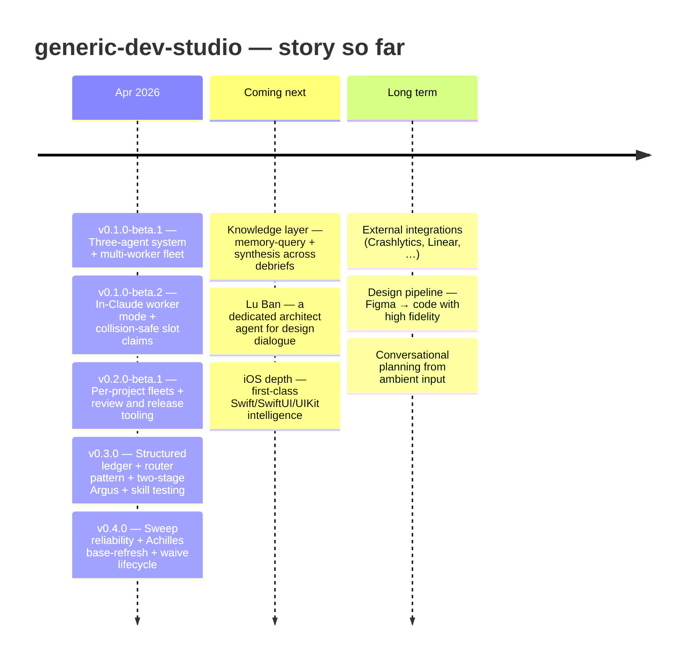

# Generic Dev Studio

A three-agent system for Claude Code. **Chanakya** plans the work; **Achilles** executes it in an isolated git worktree, self-reviews, gates on a green build, and invokes **Argus** for a pre-merge cross-file review before merging back — without ever touching your uncommitted changes.

Built around an iOS/SwiftUI project, but the orchestration layer is stack-agnostic.

All per-project artifacts live under `~/.dev-studio/<project>/` — outside `~/.claude/` so neither agent trips self-mod permission prompts.

---

## Roadmap



### Story so far

- **[v0.4.0](https://github.com/v-i-s-h-a-l/generic-dev-studio/releases/tag/v0.4.0)** — Completed tasks no longer go invisible: the sweep detects orphan debriefs — tasks that finished without landing in the master plan — and back-fills them automatically, with an honest count in the summary. Achilles auto-refreshes the base branch before Argus review so stale-merge false blocks resolve in-flight instead of forcing a manual re-run. Paused Argus gates now have a formal waive lifecycle with a SessionStart banner. Sweep completion telemetry (`inbox_sweep_completed`) is restored after a regression in 0.3.
- **[v0.3.0](https://github.com/v-i-s-h-a-l/generic-dev-studio/releases/tag/v0.3.0)** — Sessions cost ~12K fewer tokens per dispatch because mode packs load on demand instead of the old monolithic skill files. Argus splits into two sequential stages so scope drift and over-building surface cleanly. Every debrief carries a 4-state worker report code so Chanakya routes deterministically. Plans and debriefs become structured YAML under `plans/`; the master plan is a generated view. A new `/achilles debrief` captures in-chat fixes, REVIEW R10 blocks unsupported completion claims, and a SessionStart hook keeps routing intact through `/compact`.
- **[v0.2.0-beta.1](https://github.com/v-i-s-h-a-l/generic-dev-studio/releases/tag/v0.2.0-beta.1)** — Each project you use the studio on now runs its own independent fleet — workers, inboxes, queues all scoped per project. Terminal panes self-label so you can tell at a glance which project they belong to. Plus the review and release rulebooks (`REVIEW.md`, `RELEASES.md`) that future sessions auto-pick-up.
- **[v0.1.0-beta.2](https://github.com/v-i-s-h-a-l/generic-dev-studio/releases/tag/v0.1.0-beta.2)** — Workers can run as real Claude sessions (`/achilles worker`), broadcast across N panes with collision-safe slot claiming. Fleet cleanup script for between-session sweeps.
- **[v0.1.0-beta.1](https://github.com/v-i-s-h-a-l/generic-dev-studio/releases/tag/v0.1.0-beta.1)** — First beta. Three Claude agents — Chanakya plans, Achilles writes, Argus reviews — coordinated over a file-based inbox so work survives Claude restarts. Multi-worker fan-out for parallel tasks.

For the long-running tracks, see [`THEMES.md`](THEMES.md). For longer-term vision, see [`ROADMAP.md`](ROADMAP.md). For actionable backlog, see [open issues](https://github.com/v-i-s-h-a-l/generic-dev-studio/issues).

---

## TL;DR

```
# Studio router — cross-agent / studio-level ops (not task work)
/studio resume-plan              # "where were we" — load ROADMAP + ARCHITECTURE + pending memory
/studio review                   # walk REVIEW.md against the pending diff
/studio release                  # draft release notes per RELEASES.md (never auto-tags)
/studio ingest                   # capture studio-level patterns / rule-tweak proposals
/studio help                     # open the studio docs page in your browser
/studio-help                     # slash-command shortcut for /studio help

/argus                           # review current worktree (auto-invoked by Achilles pre-merge)
/argus T001                      # review a specific task's worktree standalone
/chanakya                        # describe features → get a master plan
/chanakya brief T001             # generate a self-contained worker brief
/chanakya ship T001,T002         # brief + dispatch to Achilles in one step
/chanakya brief-all              # brief every pending task in priority order
/chanakya sweep-debt             # brief + dispatch all pending debt tasks
/chanakya verify                 # guided: test-flow → promote → review-feedback
/achilles T001                   # execute (XS/S: lsp-only, M/L: full build; merges immediately)
/achilles T001 --wait            # execute, pause up to 10 min for feedback before merging
/achilles T001 --force-build     # override size-driven gate; run full xcodebuild
/achilles T001 --dry-run         # simulate every write + event; reads + LSP run normally
/achilles next                   # auto-pick highest-priority ready task and execute
/achilles build                  # on-demand build check at HEAD; auto-bisects on red
/achilles debrief                # direct-debrief: capture in-chat bug-fix as YAML debrief (no brief, no worktree, no Argus)
/chanakya status                 # tasks in flight + debt gauges + what's next
/chanakya sweep                  # Step 0 inbox sweep only, no status table (lighter)
/chanakya test-manifest          # per-task checklist → user-testing.md
/chanakya test-flow              # journey-ordered walkthrough → round files
/chanakya review-feedback        # promote passing tasks to verified; file follow-ups for failures
/chanakya sync-slack             # sync Slack bug list with master plan after a build
/chanakya sync-slack --configure-token   # one-time: save Slack bot token
/chanakya sync-slack --configure         # one-time: configure project Slack list IDs
/chanakya ingest-thread <ch> <ts>        # pull Slack thread into feedback/active.md
/chanakya ingest-dm <user>               # ingest a DM history into feedback
/chanakya ingest-slack                   # broad channel sweep into feedback
/chanakya report-design                  # filtered feedback report for design stakeholders
/chanakya report-product                 # filtered feedback report for PM stakeholders
/chanakya feedback-archive               # prune resolved records from feedback/active.md
/chanakya feedback-history               # search archived feedback (--reporter/--module/--root-cause)
/chanakya studio-feedback                # capture feedback about the studio itself → writes to canonical inbox; auto-ingested next generic-dev-studio session
/achilles studio-feedback                # same, from an Achilles session; subagents write direct to inbox

# Multi-worker fleet (BETA)
/achilles worker                 # in a Claude session (broadcast-typed across N panes); each claims a slot
scripts/achilles-worker.sh       # bash equivalent; same atomic claim, no Claude wrapper
scripts/achilles-dispatch.sh T001        # direct dispatch (single task)
scripts/achilles-queue.sh enqueue T001   # work-stealing queue — batch-friendly, no idle slots
scripts/achilles-queue.sh drain          # hand head-of-queue to each free worker
scripts/worker-status.sh                 # one-shot fleet table
scripts/achilles-cancel.sh T001          # remove pending dispatch
scripts/fleet-cleanup.sh [--dry-run|--all]  # soft sweep / full teardown

# Review-waive lifecycle (per-project pause of a gate like argus)
scripts/waive-start.sh argus "<reason>" "<sunset_trigger>"  # open a structured pause
scripts/waive-lift.sh argus                                 # lift the pause; reports merges-skipped count
scripts/backfill-orphan-debriefs.sh [--apply] [--quiet]     # recover tasks that finished but slipped the master plan
```

**Minimal-intervention by default.** Chanakya runs end-to-end without stopping for confirmation. The only points where it pauses are: Slack publish, first-time config writes (`--configure-token`, `--configure`), merge conflicts, and `--wait` mode feedback windows.

Achilles merges immediately on green and logs a "manual verification" follow-up. XS/S tasks skip `xcodebuild` (LSP-only) and accumulate **build debt** — warn at 6, block at 12. Run `/achilles build` any time: green resets the counter, red auto-bisects and files a P0 fix.

---

## What's in the Repo

```
argus/
  SKILL.md         # reviewer agent — cross-file regression risk, edge-case coverage,
                   #   test adequacy, diff anomalies, staleness, secrets

chanakya/
  SKILL.md         # manager agent — intake, briefing, status, PRD review, inbox sweep,
                   #   event log processing, test-manifest, test-flow, review-feedback,
                   #   sync-slack, ship, brief-all, sweep-debt, verify, compact,
                   #   ingest-thread/dm/slack, report-design, report-product,
                   #   feedback-archive, feedback-history
  README.md        # long-form user docs with examples
  docs.html        # interactive docs page (open in browser)

achilles/
  SKILL.md         # worker agent — isolated execution pipeline + Argus pre-merge gate

studio/
  SKILL.md         # cross-agent router — studio-level ops (resume-plan, review, release,
                   #   ingest, help); not for task work
  modes/           # Tier-1 mode packs — resume-plan, review, release, ingest, help
  docs.html        # studio docs page — capabilities, workflows, tips, troubleshooting

commands/
  chanakya-help.md      # /chanakya-help — opens chanakya docs.html in browser
  studio-help.md        # /studio-help — opens studio docs.html in browser
  pushTFBuild.md        # /pushTFBuild — archive + upload to TestFlight
  fullSendToAppStore.md # /fullSendToAppStore — submit build to App Store review

scripts/                # multi-worker fleet (BETA)
  achilles-worker.sh    # long-running worker pane; atomic slot claim via mkdir+PID-token
  achilles-dispatch.sh  # write task file to least-loaded (or pinned) worker inbox
  achilles-queue.sh     # work-stealing dispatch queue — enqueue/drain/list/depth/clear
  analyze-collect.sh    # mechanical stats for usage-analysis passes (see ANALYSIS.md)
  ingest-feedback.sh    # auto-ingests studio-feedback records into analysis + GH issues
  detect-edits.sh       # sweep-time blind-spot detector — brief_edited + debrief_edited
  appstore-watch.sh     # polls ASC for pending submission; finalizes draft release + Slack on release
  backfill-orphan-debriefs.sh  # recover tasks that finished without landing in master plan (dry-run default)
  achilles-refresh-base.sh     # auto-invoked by Achilles Step 8.4: fetch + merge base before Argus review
  worker-status.sh      # one-shot fleet status table
  achilles-cancel.sh    # remove pending dispatches
  fleet-cleanup.sh      # soft sweep (stale locks, old done/) or --all teardown
  lint-architecture.sh  # router-pattern + frontmatter + dup-prose + surface-removal checks
  test-mode-pack.sh     # skill-testing driver — runs fixtures against mode packs (on-demand, spawns claude -p)
  update-surface-manifest.sh  # regenerates docs-surface.json from command surface
  scaffold-agent.sh     # create new router-pattern-compliant agent skeleton
  graduation-scan.sh    # Jaccard scan for prose that should graduate into _shared/
  README.md             # setup, on-disk layout, env vars, caveats

.githooks/
  pre-commit            # architecture linter + privacy gate (enable via core.hooksPath)

hooks/
  session-start         # Claude Code SessionStart hook — injects router-bootstrap context on startup|resume|clear|compact

_shared/                # reusable primitives (symlinked from ~/.claude/skills/_shared/)
  file-locations.md          # project slug computation + file paths (incl. events/, reviews/)
  build-debt-schema.md       # build debt counter rules + state transitions
  debrief-format.md          # debrief file schema
  master-plan-format.md      # master plan file schema
  test-flow-format.md        # test-flow round file format
  localization-rules.md      # localization conventions
  turnip-project-config.md   # project-specific config (scheme, bundle ID, paths)
  appstore-connect-jwt.md    # JWT generation for App Store Connect API
  slack-post.md              # Slack API posting patterns
  events.md                  # event log schema, atomicity, offset marker
  review-rules.md            # Argus v1 check catalog
  test-slot.md               # 3-slot semaphore for concurrent test runs
  derived-data.md            # DerivedData path conventions + staleness guard
  push-notifications.md      # push queue format + trigger rules
  cleanup-policy.md          # artifact ownership + retention tiers + compact sweep
  brief-formats/             # brief templates (impl, unit-test, integration-test, ui-test, tdd)
```

---

## Install

### Option 1 — symlink (recommended, tracks repo updates)

```bash
ln -s "$PWD/chanakya"   ~/.claude/skills/chanakya
ln -s "$PWD/achilles"   ~/.claude/skills/achilles
ln -s "$PWD/argus"      ~/.claude/skills/argus
ln -s "$PWD/studio"     ~/.claude/skills/studio
ln -s "$PWD/_shared"    ~/.claude/skills/_shared
ln -s "$PWD/commands/chanakya-help.md"        ~/.claude/commands/chanakya-help.md
ln -s "$PWD/commands/studio-help.md"          ~/.claude/commands/studio-help.md
ln -s "$PWD/commands/pushTFBuild.md"          ~/.claude/commands/pushTFBuild.md
ln -s "$PWD/commands/fullSendToAppStore.md"   ~/.claude/commands/fullSendToAppStore.md
ln -s "$PWD/scripts"   ~/.claude/skills/scripts    # required for /achilles worker mode
```

### Option 2 — copy

```bash
cp -r argus/     ~/.claude/skills/argus/
cp -r chanakya/  ~/.claude/skills/chanakya/
cp -r achilles/  ~/.claude/skills/achilles/
cp -r studio/    ~/.claude/skills/studio/
cp -r _shared/   ~/.claude/skills/_shared/
cp commands/*.md ~/.claude/commands/
cp -r scripts/   ~/.claude/skills/scripts/         # required for /achilles worker mode
chmod +x ~/.claude/skills/scripts/*.sh
```

### Fleet prerequisites (only if you'll use multi-worker mode)

```bash
brew install fswatch coreutils yq jq
```

`yq` (v4+) drives post-2.6 YAML artifacts (`scripts/rebuild-index.sh`, `scripts/query-plans.sh`, `scripts/detect-edits.sh`). `jq` drives event-log normalization in `scripts/migrate-ledger.sh` and dedupe in `scripts/read-events.sh`. Without either, `scripts/migrate-ledger.sh` fails pre-flight.

### Git hooks (contributors only)

After cloning this repo to contribute back, enable the architecture + privacy pre-commit hook:

```bash
git config core.hooksPath .githooks
```

The hook regenerates `docs-surface.json`, runs `scripts/lint-architecture.sh --staged`, and blocks other-project runtime paths from leaking into commits. Error codes and fix recipes live in `_shared/rules/enforcement-contract.md`. Emergency bypass: `ARCH_LINT=0 git commit ...` (hotfixes only).

### One-time directories (per project)

Achilles auto-creates everything on first run. The scripts resolve paths via `scripts/lib-paths.sh` — project slug defaults to the git toplevel basename, override with `ACHILLES_PROJECT=<slug>`. No setup needed.

If you prefer to create the tree up front:

```bash
PROJECT=$(basename "$(git rev-parse --show-toplevel)")

# Per-project state (workflow, fleet, push queue — one set per project):
mkdir -p ~/.dev-studio/$PROJECT/plans/chanakya-tasks
mkdir -p ~/.dev-studio/$PROJECT/plans/chanakya-inbox/processed
mkdir -p ~/.dev-studio/$PROJECT/worktrees
mkdir -p ~/.dev-studio/$PROJECT/locks
mkdir -p ~/.dev-studio/$PROJECT/derived-data
mkdir -p ~/.dev-studio/$PROJECT/.runtime/{achilles-inbox,state}

# Machine-global state (shared across all projects — only machine resources):
mkdir -p ~/.dev-studio/.runtime/locks/test-slots
```

### Permissions

Add to `~/.claude/settings.json` under `permissions.allow`:

```json
"Read(~/.dev-studio/**)",
"Write(~/.dev-studio/**)",
"Edit(~/.dev-studio/**)",
"Bash(git *)",
"Bash(xcodebuild:*)",
"Bash(mkdir:*)"
```

`~/.dev-studio/` sits outside `~/.claude/` on purpose — agents read/write their artifacts unattended without tripping the self-mod guard.

---

## How It Works (30-second version)

1. **Chanakya** turns your feature description into prioritized tasks with IDs (`T001`, `T002`, …).
2. **Chanakya** writes a self-contained brief per task (Figma specs, codebase pointers, acceptance criteria).
3. **Achilles** reads the brief, implements in an isolated worktree, self-reviews, gates on green build, merges back, and drops a debrief.
4. **Chanakya** sweeps the inbox, marks tasks done, briefs follow-ups, tracks build/test debt.
5. When tasks accumulate: `/chanakya test-manifest` or `/chanakya test-flow` → tick boxes → `/chanakya review-feedback` → verified.

The pipeline (isolate → implement → self-review → green build → optional wait → merge → debrief → follow-ups) is the same for every task.

---

## Adapting to Other Projects

The orchestration is project-agnostic. `<project>` slug is derived from the git toplevel basename automatically.

To port to a non-iOS stack:
1. Replace the Swift/SwiftUI skill table in `chanakya/SKILL.md` with your stack's equivalents.
2. Replace `xcodebuild -derivedDataPath ...` in `achilles/modes/task.md` Step 6 with `cargo build`, `pnpm build`, `go build`, etc. Keep the per-task output-dir convention.
3. Drop Figma calls from Brief Generation Step 3 if unused.
4. Update `_shared/primitives/turnip-project-config.md` (or replace it) with your project's config.

---

## Multi-Worker Fleet (BETA)

Fan tasks out to N independent Achilles worker panes from one Chanakya session via file-based IPC.

**In-Claude (recommended):** launch `claude --dangerously-skip-permissions` in N panes, turn on iTerm Broadcast Input (`Cmd+Opt+I`), type `/achilles worker` once. Each Claude session atomically claims a slot via `mkdir worker-N/.lock` (PID-token verified — race-safe under broadcast). The session shells out to the bash watch loop in the background and stays available for status/stop questions. Tasks themselves spawn fresh `claude -p` subprocesses, so per-task context stays clean.

**Pure bash (no wrapper):** `scripts/achilles-worker.sh` in each pane. Same atomic claim, no Claude session around it.

Then dispatch from your Chanakya pane normally — Chanakya auto-detects fleet mode (alive worker dirs present) and routes `ship`/`dispatch` through `scripts/achilles-dispatch.sh`. Communication stays via the existing event log; no new IPC.

**Cleanup:** workers self-clean their `.lock` and `busy` markers on exit, and prune their own old `done/` files on boot. Between sessions or after crashes, run `scripts/fleet-cleanup.sh` (soft sweep — clears stale locks/busy/old-done, rotates large logs) or `scripts/fleet-cleanup.sh --all` (full teardown — refuses if any worker is still alive).

**Multi-project:** each project gets its own independent fleet — run one Chanakya + N workers per project. Panes auto-title as `<project>:worker-N` for at-a-glance visibility. Use `scripts/worker-status.sh --all-projects` for a machine-wide view.

See `scripts/README.md` for the full on-disk layout, env vars (`ACHILLES_PROJECT`, `ACHILLES_INBOX_ROOT`, `ACHILLES_MAX_SLOTS`, `ACHILLES_TASK_TIMEOUT_SEC`, `ACHILLES_UNATTENDED`, `ACHILLES_AUTONOMOUS`), and caveats.

---

## Docs

**Studio-level docs** (capabilities, workflows, tips, troubleshooting): [`studio/docs.html`](studio/docs.html) — or run `/studio-help` (alias: `/studio help`) from inside Claude Code.

**Agent-level command reference** (Chanakya + Achilles + Argus): [`chanakya/docs.html`](chanakya/docs.html) — or run `/chanakya-help`.

Long-form user walkthrough with examples: [`chanakya/README.md`](chanakya/README.md).

Usage-analysis procedure + report template: [`ANALYSIS.md`](ANALYSIS.md). Run `scripts/analyze-collect.sh --project <slug>` for a mechanical stats dump to seed each pass.

---

## License

MIT
