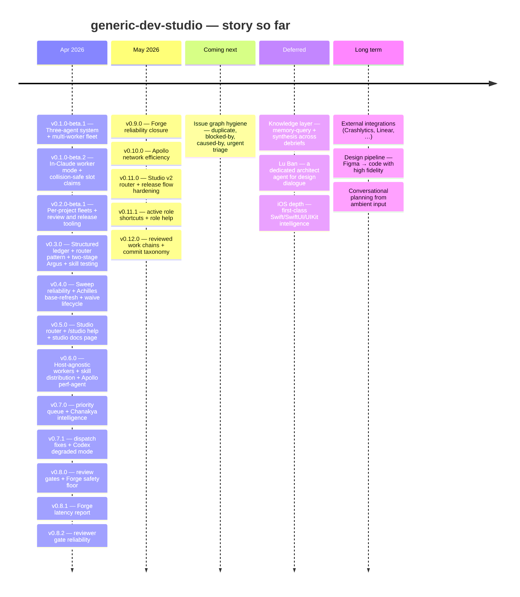

# Generic Dev Studio

A multi-host orchestration system for `/dev-studio` v2 roles. The canonical router lives in `core/v2/skills/dev-studio`; role contracts under `core/v2/roles` cover manager, planner, worker, reviewer, QA, flow testing, performance, and release work without touching your uncommitted changes.

Built around an iOS/SwiftUI project, but the orchestration layer is stack-agnostic.

All per-project artifacts live under `~/.dev-studio/<project>/` — outside `~/.claude/` so neither agent trips self-mod permission prompts.

---

## Roadmap



### Story so far

- **[v0.12.0](https://github.com/v-i-s-h-a-l/generic-dev-studio/releases/tag/v0.12.0)** — Studio work can now move from rough planning to reviewed, dependency-aware chains with less session babysitting. The manager work-chain front door, PRD normalization, task-graph synthesis, selective rule packs, checkpoint-aware resumes, and telemetry digests make long arcs easier to launch, audit, and recover. Commit messages now carry a release-friendly taxonomy, TestFlight/App Store drafts can use that metadata directly, and feature-branch merge gates are shared across chain, worktree, and PR paths so dependent branches rebase or retarget instead of quietly accumulating merge commits.
- **[v0.11.1](https://github.com/v-i-s-h-a-l/generic-dev-studio/releases/tag/v0.11.1)** — The `/dev-studio` router is easier to use after a role is selected. Once a session lands in `manager`, short follow-up commands like `status`, `ingest`, `reconcile`, `guard`, and `audit` can keep using that role while the context is clear. `/dev-studio help` shows the role index, `/dev-studio <role> help` shows examples for that role, and bare checkpoint routing still lands in manager unless the role is explicit.
- **[v0.11.0](https://github.com/v-i-s-h-a-l/generic-dev-studio/releases/tag/v0.11.0)** — The studio now runs through one canonical `/dev-studio` router instead of the old top-level role surfaces. Manager, worker, reviewer, performance, QA, flow-test, release, and host-adapter work all resolve through v2 role contracts with dedicated substrate for events, context budgets, project profiles, checkpoints, and handoffs. Long chains are easier to resume and audit, Projects-board planning is visible from the CLI, review gates are clearer, and release flows now leave a stronger trail through TestFlight tags, App Store PR lifecycle handling, Slack handoffs, withdrawn/superseded states, and release-attempt transaction logs.
- **[v0.10.0](https://github.com/v-i-s-h-a-l/generic-dev-studio/releases/tag/v0.10.0)** — Apollo can now explain network efficiency with the same strict evidence discipline it already applies to memory, thermal, battery, and CPU. Network traces, URLSession task metrics, MetricKit transfer windows, cellular-condition context, and paired Power Profiler evidence now route through a dedicated `/apollo network` mode. Guided profiling can hand a human-run app flow across battery, CPU, memory, and network, while the reviewed Apollo chain path keeps multi-issue studio work gated by sibling review before it lands.
- **[v0.9.0](https://github.com/v-i-s-h-a-l/generic-dev-studio/releases/tag/v0.9.0)** — Forge reliability work now closes with fewer loose ends: `/studio work` surfaces parallel chain opportunities, track lookups stay current as issues close, and PR review payloads land somewhere sibling hosts can actually read. Cross-host review wrappers now centralize smoke eligibility, MCP isolation, auth-home selection, and failure details. The safety floor also got sharper at runtime: Argus warnings can block risky merges, TestFlight pushes can pin an explicit marketing version with safer App Store-state checks, and build gates preserve bounded log tails when the success marker goes missing.
- **[v0.8.2](https://github.com/v-i-s-h-a-l/generic-dev-studio/releases/tag/v0.8.2)** — Reviewer-gate failures are visible again: Claude startup errors now show the useful stdout/stderr text instead of collapsing to a generic wrapper failure. The Claude reviewer profile starts from a valid empty MCP config, preserves the review prompt correctly, and launches from the repo root so relative config paths resolve consistently. Studio PR cleanup also got a practical pass: release secrets resolve through project runtime config, TestFlight release preflight is safer, PR flow instructions are clearer, and workflow/process rules are pinned to repo files rather than assistant memory.
- **[v0.8.1](https://github.com/v-i-s-h-a-l/generic-dev-studio/releases/tag/v0.8.1)** — Forge slowdown claims can now be measured instead of debated: `scripts/forge-latency-report.sh` reads canonical event logs and ranks task stages by total time, p50/p90, and sample count. It can compare end-to-end task duration before and after a cutover date, and it reports missing or impossible timings as telemetry gaps rather than pretending they took zero seconds. The Forge reliability lookup now marks #347 closed and keeps the next ten open reliability tasks visible.
- **[v0.8.0](https://github.com/v-i-s-h-a-l/generic-dev-studio/releases/tag/v0.8.0)** — Unsafe changes now get stopped before they become commits: staged diffs run through a no-secret reviewer gate, and only approved verdicts proceed. Routine studio PRs can run through a headless review + merge path that posts a machine-readable gate comment before integration. Dedicated Codex and Claude reviewer profiles keep review sessions prompt-free and secret-free. The Forge safety floor hardened around the commit and merge edges: composite merge checks, debrief-writer lint, Argus preflight events, and sweep blind-spot fixes make missing lifecycle signals visible instead of silent.
- **[v0.7.1](https://github.com/v-i-s-h-a-l/generic-dev-studio/releases/tag/v0.7.1)** — Two dispatch-breaking bugs fixed: Argus dispatch from the deployed skills tree now works (adapter dirs were invisible to the sync script), and reopened tasks dispatch on the first try (brief resolution follows UUID links instead of relying on an undocumented field). Agent bootstraps resolve paths correctly from any project CWD. Apollo runs in degraded mode on Codex hosts. Adding a new agent no longer requires a manual whitelist update — sync auto-discovers top-level dirs. Under the hood: all dispatch and lint scripts now resolve adapters from the host registry instead of hardcoded case statements; session-start validation catches missing adapters before they cause silent failures.
- **[v0.7.0](https://github.com/v-i-s-h-a-l/generic-dev-studio/releases/tag/v0.7.0)** — Release builds no longer wait in line: a priority lane puts them ahead of queued task builds the moment you trigger a push. Chanakya gains a query layer (`train` / `stale` / `blocked-by` / `dispatch-ready`), a suggestion engine that surfaces friction directly in `/chanakya status`, a digest mode for day/week/month rollups, an urgent-ingest fast-path, and a reopen lifecycle for closed tasks. Task relations now track `caused-by` edges with inverse-view rendering. Slack primitives (`slack-post.sh`, `slack-fetch.sh`) give mode packs a standard I/O channel. Apollo Stage 5 completes the perf-agent arc. The dual-write mode is retired — yaml-only is now the default across the studio.
- **[v0.6.0](https://github.com/v-i-s-h-a-l/generic-dev-studio/releases/tag/v0.6.0)** — The studio is no longer Claude-Code-only: workers, dispatch, gates, and skills run against a documented adapter contract, and a Codex node is just another node — same brief, same merge gate. Vendoring a skill is now one command (`/studio add <url>`) that pins it, writes a recipe, and fans it out to every host with `/studio sync` — drift gets surfaced before it bites. A new perf reviewer, **Apollo**, catches hot-path iOS regressions across memory, thermal, and battery patterns plus the Imgly/Metal delegation contract. One-command setup (`scripts/bootstrap.sh`) brings up a manager, worker, or dual machine without going silent in the slow stretches. Build and test gates announce themselves with stderr banners, iTerm2 badges, and terminal titles. Dispatch is now observable end-to-end via `studio.dispatch.*` telemetry with `node_fallback` / `node_unreachable` tags.
- **[v0.5.0](https://github.com/v-i-s-h-a-l/generic-dev-studio/releases/tag/v0.5.0)** — Studio-level operations get their own surface: `/studio resume-plan`, `review`, `release`, `ingest`, and `help` handle the work that isn't about your project's code but about the studio itself. `/studio-help` (or `/studio help`) opens a self-contained docs page covering the three-agent roster, every router mode, the rulebooks, common workflows, tips, and troubleshooting. `/pushTFBuild --scheme` picks up internal-tester variants. A credential-shape leak detector keeps API keys and tokens out of any public analysis output. Under the hood: ARCHITECTURE §Host-agnosticism principle lands (unblocks host-agnostic workers), a 4-layer test-strategy primitive and Swift skill-routing primitive move from scattered prose into one reference each.
- **[v0.4.0](https://github.com/v-i-s-h-a-l/generic-dev-studio/releases/tag/v0.4.0)** — Completed tasks no longer go invisible: the sweep detects orphan debriefs — tasks that finished without landing in the master plan — and back-fills them automatically, with an honest count in the summary. Achilles auto-refreshes the base branch before Argus review so stale-merge false blocks resolve in-flight instead of forcing a manual re-run. Paused Argus gates now have a formal waive lifecycle with a SessionStart banner. Sweep completion telemetry (`inbox_sweep_completed`) is restored after a regression in 0.3.
- **[v0.3.0](https://github.com/v-i-s-h-a-l/generic-dev-studio/releases/tag/v0.3.0)** — Sessions cost ~12K fewer tokens per dispatch because mode packs load on demand instead of the old monolithic skill files. Argus splits into two sequential stages so scope drift and over-building surface cleanly. Every debrief carries a 4-state worker report code so Chanakya routes deterministically. Plans and debriefs become structured YAML under `plans/`; the master plan is a generated view. A new `/achilles debrief` captures in-chat fixes, REVIEW R10 blocks unsupported completion claims, and a SessionStart hook keeps routing intact through `/compact`.
- **[v0.2.0-beta.1](https://github.com/v-i-s-h-a-l/generic-dev-studio/releases/tag/v0.2.0-beta.1)** — Each project you use the studio on now runs its own independent fleet — workers, inboxes, queues all scoped per project. Terminal panes self-label so you can tell at a glance which project they belong to. Plus the review and release rulebooks (`REVIEW.md`, `RELEASES.md`) that future sessions auto-pick-up.
- **[v0.1.0-beta.2](https://github.com/v-i-s-h-a-l/generic-dev-studio/releases/tag/v0.1.0-beta.2)** — Workers can run as real Claude sessions (`/achilles worker`), broadcast across N panes with collision-safe slot claiming. Fleet cleanup script for between-session sweeps.
- **[v0.1.0-beta.1](https://github.com/v-i-s-h-a-l/generic-dev-studio/releases/tag/v0.1.0-beta.1)** — First beta. Three Claude agents — Chanakya plans, Achilles writes, Argus reviews — coordinated over a file-based inbox so work survives Claude restarts. Multi-worker fan-out for parallel tasks.

For the long-running tracks, see [`THEMES.md`](THEMES.md). For longer-term vision, see [`ROADMAP.md`](ROADMAP.md). For actionable backlog with Project fields, see the [Studio v2 Projects board](https://github.com/users/v-i-s-h-a-l/projects/1).

---

## TL;DR

```
# Studio v2 router — canonical role dispatch
/dev-studio manager              # bare role landing — suggests next moves, then reports the direct command
/dev-studio help                 # router-level role index; active-role help after a role is selected
/dev-studio <role> help          # available commands and examples for one role
/dev-studio manager resume-plan  # "where were we" — load ROADMAP + ARCHITECTURE + pending memory
/dev-studio reviewer review      # walk REVIEW.md against the pending diff
/dev-studio release-manager      # draft release notes per RELEASES.md (never auto-tags)
/dev-studio release-manager configure # one-time release notification setup (Slack TF/App Store)
/dev-studio manager ingest       # capture one idea in the current repo context; --scope studio crosses to Forge
/dev-studio manager reconcile    # project repo: sync emitted debriefs/reports into the task ledger
/dev-studio manager analyze      # studio repo: telemetry/log analysis plus studio feedback triage
/dev-studio manager work-chain prd-to-chain-automation # auto-run the PRD automation chain; bare call discovers available chains
/dev-studio manager work-chain prd-to-chain-automation --dry-run # preferred preview path for attended planning
/dev-studio manager work-chain --resume <run_id> --yes # preferred resume path from chain summaries/halt records
scripts/manager-work-chain.sh prd-to-chain-automation # repo-side wrapper for the manager work-chain front door
scripts/prd-intake-normalize.sh prd.md # normalize a PRD/transcript/issue brief into a planner-ready requirement packet
scripts/prd-task-graph-synthesize.sh packet.md # turn a requirement packet into a validated scheduler graph
/dev-studio checkpoint           # manager-shaped checkpoint routing; stdout is the checkpoint id for resume
/dev-studio worker checkpoint    # worker-owned compact checkpoint; does not replace worker summary
/dev-studio worker resume-checkpoint # resume worker checkpoint via manifest.json + context.md first
/studio-help                     # open the v2 router docs
scripts/studio-chain-runner.sh --discover # bare invocation lists runnable chains, resumable runs, and next actions
scripts/studio-chain-runner.sh --discover prd-to-chain-automation # filtered discovery for one chain or manifest
scripts/manager-work-chain.sh prd-to-chain-automation --dry-run # preview the named chain through the manager front door
scripts/studio-chain-runner.sh --auto workflow-measurement-improvements # unattended safe start/resume for one manifest
scripts/studio-chain-runner.sh workflow-measurement-improvements --attended --yes # attended run with explicit confirmation bypass
scripts/studio-chain-runner.sh workflow-measurement-improvements --unattended --yes # no routine continue prompts; typed blockers halt
scripts/studio-chain-runner.sh --resume <run_id> --yes # resume state; reconcile completed worker summaries before dependents
scripts/studio-chain-runner.sh workflow-measurement-improvements --checkpoint auto --dry-run # preview checkpoint-aware safe-boundary hooks
scripts/studio-chain-runner.sh --explain-next workflow-measurement-improvements # show next supervisor action without state mutation
scripts/studio-chain-rule-gates.sh --plan plan.json --dry-run # deterministic rule-pack workflow gates with JSON audit output
scripts/rule-pack-resolve.sh --manifest chain.yaml --chain my-chain --issue 123 --role worker # selective rule-pack selection with context-budget telemetry
scripts/studio-chain-telemetry-digest.sh --days 7     # weekly v1 counters, efficiency ratios, and bottlenecks from private chain-run telemetry
scripts/studio-checkpoint.sh resume --checkpoint-id <id> --role worker # compact session resume by id; add --latest for branch-scoped lookup
scripts/studio-staleness-triage.sh --json        # preview PM-surface stale/escalation/archive-candidate issue labels
STUDIO_TRACK=<track>             # session-start shortcut for v2 track work
/dev-studio host-adapter nodes   # day-2 fleet management — status, add, remove, health, sync, schedule
/dev-studio release-manager tf-push --background     # start TF archive/upload and keep session free for Slack drafting
/dev-studio release-manager tf-push --version 26.5.0 # TestFlight push with explicit MARKETING_VERSION; live work needs STUDIO_TF_PUSH_LIVE=1
scripts/studio-tf-push.sh compose-message --channel testflight < commits.txt # taxonomy-aware release/TestFlight bullet composer
scripts/studio-tf-push.sh withdraw-tf-tag --version 26.4.17 --build 3162 # rename TF anchor to tf-<version>-<build>-WITHDRAWN
scripts/release-manager-configure.sh --project turnip-ios --quick --appstore-slack-channel C... # configure opt-in App Store Slack release announcements
/studio-setup                    # onboard THIS machine — auto-pilot, prompts for role only
/studio-setup --manager          # zero-prompt manager onboarding
/studio-setup --worker           # zero-prompt worker (id = hostname; --id X to override)
/studio-setup --dual             # both roles on one machine
/studio-setup --interactive      # legacy: prompt at every step
/studio-setup --help             # open the v2 router docs + usage summary

/dev-studio manager              # conversational shaping and cwd-aware landing
/dev-studio worker <contract>    # worker role execution contract
/dev-studio reviewer             # reviewer landing for diff, plan, outcome, PR, or release packet
/dev-studio reviewer review      # reviewer role contract
/dev-studio perf profile         # performance role contract
/dev-studio planner              # planning/architecture role contract
/dev-studio qa-engineer          # synthetic QA role contract
/dev-studio flow-tester          # exploratory flow-test role contract

# Multi-worker fleet (BETA)
/dev-studio worker               # worker role surface
scripts/achilles-worker.sh       # bash equivalent; same atomic claim, no Claude wrapper
scripts/achilles-dispatch.sh T001        # direct dispatch (single task)
scripts/achilles-queue.sh enqueue T001   # work-stealing queue — batch-friendly, no idle slots
scripts/achilles-queue.sh drain          # hand head-of-queue to each free worker
scripts/worker-status.sh                 # one-shot fleet table
scripts/achilles-cancel.sh T001          # remove pending dispatch
scripts/fleet-cleanup.sh [--dry-run|--all]  # soft sweep / full teardown

# Review-waive lifecycle (per-project pause of a gate like reviewer)
scripts/waive-start.sh reviewer "<reason>" "<sunset_trigger>"  # open a structured pause
scripts/waive-lift.sh reviewer                                 # lift the pause; reports merges-skipped count
scripts/backfill-orphan-debriefs.sh [--apply] [--quiet]     # recover tasks that finished but slipped the master plan
scripts/forge-latency-report.sh --days 14                   # stage-level Forge task latency from event logs
scripts/field-workflow-report.sh --days 14                  # Field loop timing, tokens, gate pass rates, review coverage, improvement candidates
scripts/studio-pr-baseline-report.sh 366                    # PR-level timing, churn, gate, and generated-file baselines
scripts/studio-weekly.sh --post                             # weekly GitHub PM digest; cron posts to the pinned summary issue
scripts/host-preflight.sh codex /repo                       # prove gh + git credential access before host task work
scripts/studio-project-state.sh --status Todo               # Project-field backlog reader for Status / Track / Phase / Size / review state
scripts/studio-gh.sh issue list --state open                # assistant-safe GitHub CLI wrapper for narrow issue lookups; normalizes synthetic Codex HOME
scripts/manager-reconcile.sh --cwd "$PWD"                   # project report/debrief sync into the project task ledger
scripts/manager-analyze.sh --cwd "$PWD"                     # studio-checkout analysis and feedback triage
scripts/studio-dependency-export.sh --issue 443             # Mermaid graph from native GitHub blocked_by dependencies
scripts/studio-chain-reviewed.sh v2-transition --host codex --review-host claude-reviewer  # pre-run plan review + reviewed chain PR merges
# Chain manifests may set phase_review: required|auto|off; required/auto gates issue phases through scripts/phase-review.sh and forwards compact clean outcome feedback privately.
scripts/issue-body-edit.sh 463 --repo owner/repo --body-file generated.md --apply  # guarded issue body replacement; dry-run unless --apply
scripts/pre-commit-review.sh                                # manual no-secret reviewer gate for risky staged diffs
scripts/v2-role-resolve.sh chanakya                         # resolve Studio v2 compatibility aliases to canonical role names
scripts/v2-role-contract.sh --resolve --role shipper         # resolve migrated v2 role contracts
scripts/lint-v2-enforcement.sh --staged                     # A0.6 Studio v2 SPEC-derived substrate/profile gates
scripts/lint-chain-workflow-docs.sh --staged                # keep chain launcher docs, usage text, and fixtures aligned
scripts/v2-profile.sh --profile ios-turnip --list           # A6 project-profile operation resolver
scripts/v2-cutover.sh --status                              # A9 v1 archive / v2 traffic-switch status
scripts/lint-build-release-message.sh --file draft.md --channel testflight # A11 build/release message shape + duplicate lint
scripts/pr-headless-review.sh <pr>                          # run smoke-eligible no-secret reviewer gate, then merge only if the reused chain-style feature-branch gate keeps head history linear relative to its base
scripts/pr-headless-review.sh <pr> --no-require-cross-host   # opt out of the default independent-provider reviewer requirement
scripts/resolve-reviewer-model.sh --review-host codex-reviewer --implementation-host claude-code  # resolve reviewer model from policy
scripts/check-model-catalog.sh --print-refresh-checklist     # validate refreshable model IDs against official-source metadata
scripts/recommend-model.sh --size s --kind impl --cross-file-count 3 --novelty-score 1
```

**Minimal-intervention by default.** Studio v2 routes through canonical roles under `/dev-studio`. The former top-level v1 agent surfaces were removed by A10; compatibility names such as `chanakya`, `achilles`, `argus`, and `apollo` now live as v2 role aliases.

**Session-local role shortcuts.** After a bare role landing such as `/dev-studio manager`, unqualified commands like `status`, `ingest`, `reconcile`, `guard`, or `audit` may resolve through that role while the session context is clear. Explicit `/dev-studio <role> ...` always wins; bare `/dev-studio` re-lands in manager.

---

## What's in the Repo

```
core/v2/skills/dev-studio/
  SKILL.md         # v2 umbrella role router; active-role and help intent rules
  docs.html        # self-contained /dev-studio docs page with per-role help
  routing.yaml     # /dev-studio invocation metadata and help triggers
  forwarders.yaml  # post-A10 compatibility-alias state

core/v2/roles/
  *.yaml           # canonical role contracts: manager, worker, reviewer, perf,
                   #   planner, qa-engineer, flow-tester, release-manager

core/v2/handoffs/
  *.yaml           # typed handoff fixtures shared across roles

.claude/commands/       # project-scoped slash commands (fire only when cwd is this repo)
  studio-help.md        # /studio-help — opens the v2 router docs
  studio-setup.md       # /studio-setup — onboard THIS machine (--manager/--worker/--dual; no args = auto-pilot prompting only for role)
  resume-plan.md        # /resume-plan — routes through /dev-studio manager
  capture.md            # /capture — retrospective session scan → IDEAS.md

commands/               # globally-installed slash commands (see scripts/install.sh)
  dev-studio.md         # /dev-studio — v2 umbrella role router from any project
  pushTFBuild.md        # /pushTFBuild — archive + upload to TestFlight; --background keeps Slack drafting live
  fullSendToAppStore.md # /fullSendToAppStore — submit build to App Store review

scripts/                # multi-worker fleet (BETA)
  achilles-worker.sh    # long-running worker pane; atomic slot claim via mkdir+PID-token
  achilles-dispatch.sh  # write task file to least-loaded (or pinned) worker inbox
  achilles-queue.sh     # work-stealing dispatch queue — enqueue/drain/list/depth/clear
  chanakya-task-train.sh # manual single-train runner with sibling plan/outcome reviews and resume state
  analyze-collect.sh    # mechanical stats for usage-analysis passes (see ANALYSIS.md)
  release-manager-configure.sh # project release notification setup (Slack first)
  forge-latency-report.sh  # stage-level task latency + review-gate comparison from event logs
  field-workflow-report.sh # Field loop report: timing, token, gate, review, and improvement mining
  studio-pr-baseline-report.sh # PR-level timing, churn, gate, and generated-file baselines
  studio-dependency-export.sh # Mermaid graph from native GitHub blocked_by issue dependencies
  studio-weekly.sh     # weekly GitHub issue digest; scheduled workflow posts to the pinned summary issue
  studio-chain-runner.sh   # plan/execute/discover/auto-resume/list studio issue chains with capacity-scaled fresh sessions, UUID telemetry, optional checkpoint hooks, locks, and private run reports
  studio-chain-rule-gates.sh # deterministic chain workflow gates for git hygiene, artifact roots, cache keys, cleanup TTLs, and telemetry redaction
  studio-chain-telemetry-digest.sh # v1 counters, efficiency ratios, bottlenecks, and weekly digest from private chain-run reports/events
  prd-intake-normalize.sh # deterministic PRD/transcript/issue brief normalization into a small requirement packet
  prd-task-graph-synthesize.sh # deterministic requirement-packet to scheduler-graph synthesis with dependency/race validation
  studio-checkpoint.sh # compact create/update/resume checkpoints under per-project .runtime/v2/checkpoints
  issue-body-edit.sh  # guarded GitHub issue body replacement from generated content
  studio-staleness-triage.sh # scheduled GitHub issue staleness labels + escalation comments for the PM surface
  host-preflight.sh    # pre-task host parity gate: gh auth + git ls-remote credential access
  studio-gh.sh          # GitHub CLI wrapper for assistant/interactive calls; normalizes synthetic Codex HOME
  dev-studio-ingest-resolve.sh # resolves /dev-studio manager ingest destination as JSON
  manager-reconcile.sh  # /dev-studio manager reconcile: project debrief/report sync into task state
  manager-analyze.sh    # /dev-studio manager analyze: studio-checkout analysis + feedback triage
  ingest-feedback.sh    # routes studio-feedback records to analysis + GH issue create/comment/defer
  analyze-feedback-ingest.sh # studio feedback triage: consolidate into existing/new GH issues before processed/
  detect-edits.sh       # sweep-time blind-spot detector — brief_edited + debrief_edited
  compose-build-release-message.sh # taxonomy-aware TestFlight/App Store bullet composer
  appstore-watch.sh     # polls ASC; publishes release + promotes PR only at READY_FOR_SALE after release approval is recorded
  backfill-orphan-debriefs.sh  # recover tasks that finished without landing in master plan (dry-run default)
  achilles-refresh-base.sh     # legacy worker helper: fetch + merge base before reviewer handoff
  task-merge.sh                # serialized merge gate: approved-only option + post-review base re-check
  worker-status.sh      # one-shot fleet status table
  achilles-cancel.sh    # remove pending dispatches
  fleet-cleanup.sh      # soft sweep (stale locks, old done/) or --all teardown
  lint-architecture.sh  # staged router/frontmatter checks; --full runs repository-wide audits
  lint-project-skill-links.sh # blocks missing repo-local project skill discovery links
  v2-role-resolve.sh    # Studio v2 canonical role + compatibility alias resolver
  v2-role-contract.sh   # Studio v2 migrated role-contract resolver
  lint-v2-enforcement.sh # A0.6 Studio v2 SPEC-derived substrate/profile gates
  lint-chain-workflow-docs.sh # guards chain launcher docs, usage text, and regression fixtures
  v2-profile.sh          # A6 resolver/runner for profile-owned build/test/lint/release operations
  lint-build-release-message.sh # A11 build/release message shape + duplicate linter
  test-mode-pack.sh     # skill-testing driver — runs fixtures against mode packs (on-demand, spawns claude -p)
  lint-field-review-surfaces.sh # blocks raw cross-host review snippets outside phase-review wrappers
  lint-v2-bootstrap.sh  # A0.4 substrate bootstrap gate before A0.5 SPEC sign-off
  v2-cutover.sh         # A9 cutover manifest validator and rollback status reporter
  update-surface-manifest.sh  # regenerates docs-surface.json from command surface
  scaffold-agent.sh     # create new router-pattern-compliant agent skeleton
  graduation-scan.sh    # Jaccard scan for prose that should graduate into _shared/
  README.md             # setup, on-disk layout, env vars, caveats

.githooks/
  commit-msg            # commit message trailer lint for studio-managed commits
  pre-commit            # architecture linter + privacy gate (enable via core.hooksPath)

hooks/
  session-start         # Claude Code SessionStart hook — injects router-bootstrap context on startup|resume|clear|compact

_shared/                # reusable primitives (symlinked from ~/.claude/skills/_shared/)
  file-locations.md          # project slug computation + file paths (incl. events/, reviews/)
  build-debt-schema.md       # build debt counter rules + state transitions
  debrief-format.md          # debrief file schema
  master-plan-format.md      # master plan file schema
  test-flow-format.md        # test-flow round file format
  localization-rules.md      # localization conventions
  turnip-project-config.md   # project-specific config (scheme, bundle ID, paths)
  appstore-connect-jwt.md    # JWT generation for App Store Connect API
  slack-post.md              # Slack API posting patterns
  events.md                  # event log schema, atomicity, offset marker
  review-rules.md            # Argus v1 check catalog
  test-slot.md               # 3-slot semaphore for concurrent test runs
  derived-data.md            # DerivedData path conventions + staleness guard
  push-notifications.md      # push queue format + trigger rules
  cleanup-policy.md          # artifact ownership + retention tiers + compact sweep
  brief-formats/             # brief templates (impl, unit-test, integration-test, ui-test, tdd)
```

---

## Install

```bash
./scripts/install.sh          # idempotent — re-run safely after pulls
./scripts/verify-install.sh   # reports any drift between repo and ~/.claude/
```

`install.sh` symlinks shared companions (`_shared`, `scripts`, `hosts`) into `~/.claude/skills/` and global slash commands into `~/.claude/commands/`. Portable v2 skills are fanned out by `scripts/sync-host-skills.sh` from `core/v2/skills`.

Claude Code uses the global `/dev-studio` command at `~/.claude/commands/dev-studio.md`. Other hosts load the router skill from their global skill directory, for example `~/.codex/skills/dev-studio`, so you can invoke the studio from the project you are actually working on.

Fresh-clone workflow:

```bash
git clone <this-repo> && cd generic-dev-studio
./scripts/install.sh
# /dev-studio is installed globally; v1 top-level agents are deleted after A10
```

### Fleet prerequisites (only if you'll use multi-worker mode)

```bash
brew install fswatch coreutils yq jq shellcheck
```

`yq` (v4+) drives post-2.6 YAML artifacts (`scripts/rebuild-index.sh`, `scripts/query-plans.sh`, `scripts/query-tasks.sh`, `scripts/detect-edits.sh`). `jq` drives event-log normalization in `scripts/migrate-ledger.sh` and dedupe in `scripts/read-events.sh`. Without either, `scripts/migrate-ledger.sh` fails pre-flight.
`shellcheck` lint-checks Bash scripts before script changes land.

### Git hooks (contributors only)

After cloning this repo to contribute back, enable the deterministic architecture and privacy pre-commit hook:

```bash
git config core.hooksPath .githooks
```

The hook blocks commits on local base branches (`main`, `master`, `trunk`, `develop`) so local `main` stays a mirror of `origin/main`; emergency bypass is explicit with `STUDIO_BYPASS_MAIN_COMMIT_GUARD=1 git commit ...`. It regenerates `docs-surface.json`, runs the architecture/privacy gates, and emits `precommit_hook_completed` with `duration_s`. It also runs `scripts/lint-v2-bootstrap.sh --staged`, which keeps the v2 substrate inside the A0.4 bootstrap/meta boundary until the A0.5 SPEC sign-off marker lands. `scripts/lint-chain-workflow-docs.sh --staged` keeps the chain launcher docs, `studio-chain-runner` usage banner, `manager-work-chain` defaults, and discovery fixtures aligned; bypass only for emergency drift triage with `STUDIO_BYPASS_CHAIN_WORKFLOW_DOCS=1 git commit ...`. SessionStart emits `session_start_completed` against a 5s warning budget and stays quiet unless that budget is exceeded. It does not spawn an LLM reviewer by default. Run `scripts/pre-commit-review.sh` manually before committing risky local diffs; its bypass remains explicit (`STUDIO_BYPASS_REVIEW=1` or `--bypass-review`) and audited through `precommit_review_bypassed`. Multi-phase work uses `scripts/phase-review.sh --review-host <claude-reviewer|codex-reviewer> --input phase-plan.md --output ~/.dev-studio/<project>/analysis/...` so sibling-host reviews go through the same smoke-eligible reviewer profiles instead of raw host CLI calls and emit `PHASE_REVIEW_VERDICT=clean|blocked|ambiguous` for deterministic callers. If the requested reviewer fails eligibility, execution, timeout, or verdict parsing, `phase-review.sh` tries another cross-host reviewer first; if none returns usable output, it may use the parent host's reviewer profile as a degraded continuity path, emitting `PHASE_REVIEW_DEGRADED=1`, `PHASE_REVIEW_CROSS_HOST_SATISFIED=false`, and `PHASE_REVIEW_NEXT_CROSS_HOST_RETRY=next_boundary`. Claude subscription/403 fallback can be forced off with `STUDIO_DISABLE_PHASE_REVIEW_CLAUDE_403_FALLBACK=1`; degraded same-host continuity can be forced off with `STUDIO_DISABLE_PHASE_REVIEW_DEGRADED_SAME_HOST=1`. Chain manifests can opt issue phases into the same gate with `phase_review: required|auto|off`; clean outcome warnings, recommendations, and accepted plan adjustments are forwarded only as compact private context to later issue start envelopes. `scripts/lint-field-review-surfaces.sh` blocks new field-agent review setup that reintroduces raw host commands. PR integration still goes through `scripts/pr-headless-review.sh`, with timing split across reviewer, autopilot, and merge-finalize events; PR gate comments now expose parent host, smoke-eligible reviewer profiles, selected reviewer, cross-host status, fallback attempts, and selected reviewer model metadata. Reviewer model names resolve through `_shared/schemas/model-catalog.yaml` plus `_shared/rules/model-policy.yaml`; treat them as refreshable policy, not shell-script constants. Cross-provider PR review is required by default; same-host PR fallback requires `--allow-same-host-review --user-approved-bypass <github-url>`, and `--no-require-cross-host` is only for explicit non-safety-floor runs. Claude reviewers use `CLAUDE_REVIEWER_HOME` plus `CLAUDE_REVIEWER_CONFIG_DIR`; set the home to a locked-down reviewer account on fleet nodes. Use `scripts/studio-pr-baseline-report.sh <pr>` during retrospectives to compare phase timing, churn, and gate gaps across PR classes; use the numbers to tune workflow bottlenecks, not to score individual productivity. Error codes and fix recipes live in `_shared/rules/enforcement-contract.md`. Emergency lint bypass: `ARCH_LINT=0 git commit ...` (hotfixes only).
`.githooks/commit-msg` also runs `scripts/lint-commit-message.sh` for all commit message edits and fails fast when `Change-Type` or `Studio-Host` trailers are invalid or missing in strict automation contexts. Set `STUDIO_BYPASS_COMMIT_TRAILER_LINT=1` to bypass this hook in an explicit emergency.

### Feature branches and grouped PRs

Use one feature or reliability branch for related issues when they share a workflow surface, safety-floor path, test fixture set, or user-facing capability. Keep issue closure explicit in the PR body (`Closes #353`, `Closes #355`, ...), and split once the branch needs unrelated reviewers, mixes urgent and non-urgent work, or becomes hard to review in one pass. Direct pushes to `main` remain forbidden; grouped work still merges through the PR review gate.

### Release-bearing chains

Release-bearing chain manifests declare `approved_release_id`. The manager picks
one chain branch from the manifest, launches every issue leaf from that branch,
and integrates completed leaves back into that same manager-owned branch before
the final PR targets the manifest base. Leaf sessions should not retarget
themselves to `main` or another integration branch.

The default leaf integration strategy is `sync_strategy: rebase`: the runner
rebases the issue leaf onto the current chain branch and fast-forwards the chain
branch. `sync_strategy: squash` is opt-in for release-bearing chains that need a
single commit per leaf. Immediately before integration, the runner records
`release_chain_sync_strategy`, `release_chain_leaf_ancestry`, and
`release_chain_leaf_merge_commits` gate rows. Those gates reject unsupported
sync strategies, leaves that no longer descend from the launch chain commit, and
post-launch merge commits in the leaf. User-controlled emergency overrides are
audited through the matching `STUDIO_BYPASS_CHAIN_*` variables.

Approved-release promotion is also HEAD-bound. `pr-merge-finalize` records the
release approval only after it finds the studio review-gate comment for the
current PR `HEAD_SHA`; App Store promotion routes through that same finalizer, so
missing or stale approval metadata cannot promote the release PR to `main`.

### One-time directories (per project)

Worker scripts auto-create everything on first run. The scripts resolve paths via `scripts/lib-paths.sh` — project slug defaults to the git toplevel basename, override with `ACHILLES_PROJECT=<slug>`. No setup needed.

If you prefer to create the tree up front:

```bash
PROJECT=$(basename "$(git rev-parse --show-toplevel)")

# Per-project state (workflow, fleet, push queue — one set per project):
mkdir -p ~/.dev-studio/$PROJECT/plans/{tasks,briefs,debriefs,reviews}
mkdir -p ~/.dev-studio/$PROJECT/worktrees
mkdir -p ~/.dev-studio/$PROJECT/locks
mkdir -p ~/.dev-studio/$PROJECT/derived-data
mkdir -p ~/.dev-studio/$PROJECT/.runtime/{achilles-inbox,state}

# Machine-global state (shared across all projects — only machine resources):
mkdir -p ~/.dev-studio/.runtime/locks/test-slots
```

### Claude Permissions

Add to `~/.claude/settings.json` under `permissions.allow`:

```json
"Read(~/.dev-studio/**)",
"Write(~/.dev-studio/**)",
"Edit(~/.dev-studio/**)",
"Bash(git *)",
"Bash(xcodebuild:*)",
"Bash(mkdir:*)"
```

`~/.dev-studio/` sits outside `~/.claude/` on purpose — agents read/write their artifacts unattended without tripping the self-mod guard.

Optional node monitoring installs `~/Library/LaunchAgents/dev.studio.node-monitor.plist` via `scripts/monitor-install.sh install`. That path is outside `~/.dev-studio/**` by design because launchd only loads user agents from `~/Library/LaunchAgents`.

### Codex Permissions

Codex needs the same runtime root in its workspace-write sandbox. Launch with an explicit writable root:

```sh
codex --sandbox workspace-write --add-dir ~/.dev-studio
```

Or persist it in `~/.codex/config.toml`:

```toml
sandbox_mode = "workspace-write"

[sandbox_workspace_write]
writable_roots = ["/Users/<you>/.dev-studio"]
```

Studio chain issue sessions do not need write access to the main checkout's
linked-worktree metadata. For `workspace-write` hosts, `studio-chain-runner`
uses a per-issue local clone so normal `git add` and `git commit` write inside
the issue working directory plus `~/.dev-studio`.
When `--checkpoint auto` or manifest `checkpoint: auto` is enabled, chain
checkpoints stay under the same private runtime root and resume only through
the manager role plus the active chain branch after drift checks.

For unattended worker sessions, combine the writable root with `--ask-for-approval never`.

---

## How It Works (30-second version)

1. `/dev-studio manager` shapes feature requests into role-scoped work and handoffs.
2. `/dev-studio planner`, `worker`, `reviewer`, `qa-engineer`, `flow-tester`, `perf`, and `release-manager` are canonical role contracts under `core/v2/roles/`.
3. Handoffs between roles use typed YAML fixtures under `core/v2/handoffs/`.
4. Cross-host phase and outcome reviews run through `scripts/phase-review.sh`.
5. Compatibility names such as `chanakya`, `achilles`, `argus`, and `apollo` resolve through `scripts/v2-role-resolve.sh`.

The active router state is recorded by `core/v2/skills/dev-studio/forwarders.yaml` and `core/v2/cutover/manifest.yaml`.

---

## Adapting to Other Projects

The orchestration is project-agnostic. `<project>` slug is derived from the git toplevel basename automatically.

To port to a non-iOS stack:
1. Replace the Swift/SwiftUI skill routing rules in `AGENTS.md` / `CLAUDE.md` with your stack's equivalents.
2. Update the v2 worker and QA role contracts under `core/v2/roles/`.
3. Replace iOS-specific release and project config primitives under `_shared/`.

---

## Multi-Worker Fleet (BETA)

Fan tasks out to N independent worker panes from a manager session via file-based IPC.

**In-host session:** launch N host sessions, turn on iTerm Broadcast Input (`Cmd+Opt+I`), and route each to `/dev-studio worker`. Each session atomically claims a slot via `mkdir worker-N/.lock` (PID-token verified — race-safe under broadcast). The session shells out to the bash watch loop in the background and stays available for status/stop questions.

**Pure bash (no wrapper):** `scripts/achilles-worker.sh` in each pane. Same atomic claim, no Claude session around it.

Then dispatch from the manager normally. The manager detects fleet mode (alive worker dirs present) and routes dispatch through the worker queue scripts. Communication stays via the existing event log; no new IPC.

**Cleanup:** workers self-clean their `.lock` and `busy` markers on exit, and prune their own old `done/` files on boot. Between sessions or after crashes, run `scripts/fleet-cleanup.sh` (soft sweep — clears stale locks/busy/old-done, rotates large logs) or `scripts/fleet-cleanup.sh --all` (full teardown — refuses if any worker is still alive).

**Multi-project:** each project gets its own independent fleet — run one manager + N workers per project. Panes auto-title as `<project>:worker-N` for at-a-glance visibility. Use `scripts/worker-status.sh --all-projects` for a machine-wide view.

See `scripts/README.md` for the full on-disk layout, env vars (`ACHILLES_PROJECT`, `ACHILLES_INBOX_ROOT`, `ACHILLES_MAX_SLOTS`, `ACHILLES_TASK_TIMEOUT_SEC`, `ACHILLES_UNATTENDED`, `ACHILLES_AUTONOMOUS`), and caveats.

---

## Docs

**Studio v2 router**: [`core/v2/skills/dev-studio/docs.html`](core/v2/skills/dev-studio/docs.html) — or run `/studio-help` from inside Claude Code. Router source lives at [`core/v2/skills/dev-studio/SKILL.md`](core/v2/skills/dev-studio/SKILL.md).

**Role contracts**: [`core/v2/roles/`](core/v2/roles/).

Usage-analysis procedure + report template: [`ANALYSIS.md`](ANALYSIS.md). Run `scripts/analyze-collect.sh --project <slug>` for a mechanical stats dump to seed each pass.

---

## License

MIT
