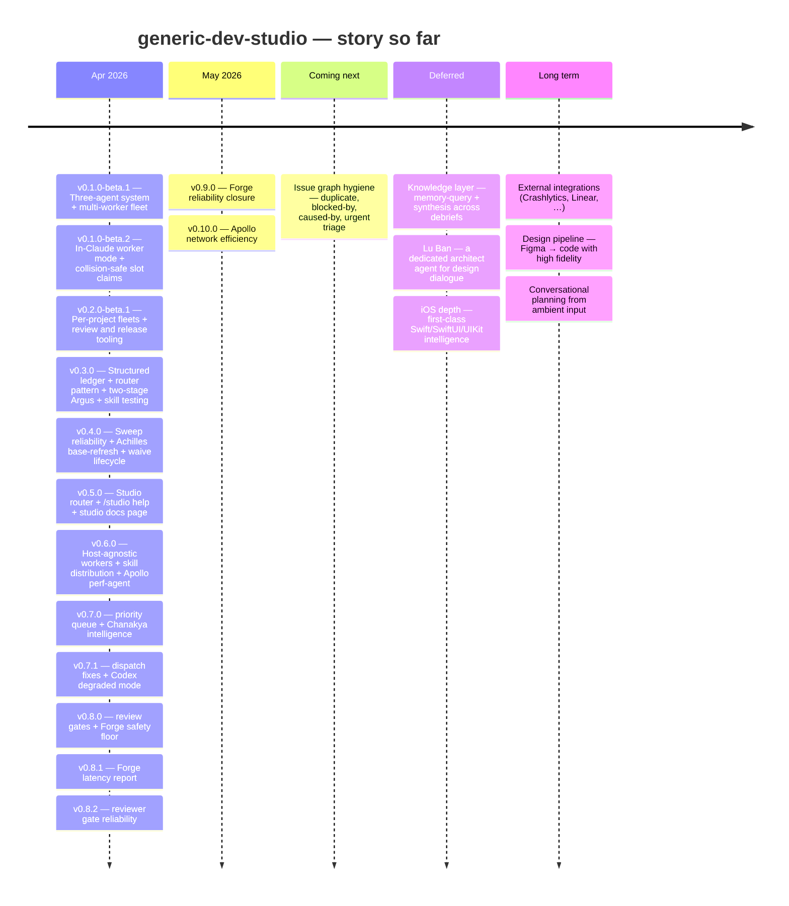

# Generic Dev Studio

A three-agent system for Claude Code. **Chanakya** plans the work; **Achilles** executes it in an isolated git worktree, self-reviews, gates on a green build, and invokes **Argus** for a pre-merge cross-file review before merging back — without ever touching your uncommitted changes.

Built around an iOS/SwiftUI project, but the orchestration layer is stack-agnostic.

All per-project artifacts live under `~/.dev-studio/<project>/` — outside `~/.claude/` so neither agent trips self-mod permission prompts.

---

## Roadmap



### Story so far

- **[v0.10.0](https://github.com/v-i-s-h-a-l/generic-dev-studio/releases/tag/v0.10.0)** — Apollo can now explain network efficiency with the same strict evidence discipline it already applies to memory, thermal, battery, and CPU. Network traces, URLSession task metrics, MetricKit transfer windows, cellular-condition context, and paired Power Profiler evidence now route through a dedicated `/apollo network` mode. Guided profiling can hand a human-run app flow across battery, CPU, memory, and network, while the reviewed Apollo chain path keeps multi-issue studio work gated by sibling review before it lands.
- **[v0.9.0](https://github.com/v-i-s-h-a-l/generic-dev-studio/releases/tag/v0.9.0)** — Forge reliability work now closes with fewer loose ends: `/studio work` surfaces parallel chain opportunities, track lookups stay current as issues close, and PR review payloads land somewhere sibling hosts can actually read. Cross-host review wrappers now centralize smoke eligibility, MCP isolation, auth-home selection, and failure details. The safety floor also got sharper at runtime: Argus warnings can block risky merges, TestFlight pushes can pin an explicit marketing version with safer App Store-state checks, and build gates preserve bounded log tails when the success marker goes missing.
- **[v0.8.2](https://github.com/v-i-s-h-a-l/generic-dev-studio/releases/tag/v0.8.2)** — Reviewer-gate failures are visible again: Claude startup errors now show the useful stdout/stderr text instead of collapsing to a generic wrapper failure. The Claude reviewer profile starts from a valid empty MCP config, preserves the review prompt correctly, and launches from the repo root so relative config paths resolve consistently. Studio PR cleanup also got a practical pass: release secrets resolve through project runtime config, TestFlight release preflight is safer, PR flow instructions are clearer, and workflow/process rules are pinned to repo files rather than assistant memory.
- **[v0.8.1](https://github.com/v-i-s-h-a-l/generic-dev-studio/releases/tag/v0.8.1)** — Forge slowdown claims can now be measured instead of debated: `scripts/forge-latency-report.sh` reads canonical event logs and ranks task stages by total time, p50/p90, and sample count. It can compare end-to-end task duration before and after a cutover date, and it reports missing or impossible timings as telemetry gaps rather than pretending they took zero seconds. The Forge reliability lookup now marks #347 closed and keeps the next ten open reliability tasks visible.
- **[v0.8.0](https://github.com/v-i-s-h-a-l/generic-dev-studio/releases/tag/v0.8.0)** — Unsafe changes now get stopped before they become commits: staged diffs run through a no-secret reviewer gate, and only approved verdicts proceed. Routine studio PRs can run through a headless review + merge path that posts a machine-readable gate comment before integration. Dedicated Codex and Claude reviewer profiles keep review sessions prompt-free and secret-free. The Forge safety floor hardened around the commit and merge edges: composite merge checks, debrief-writer lint, Argus preflight events, and sweep blind-spot fixes make missing lifecycle signals visible instead of silent.
- **[v0.7.1](https://github.com/v-i-s-h-a-l/generic-dev-studio/releases/tag/v0.7.1)** — Two dispatch-breaking bugs fixed: Argus dispatch from the deployed skills tree now works (adapter dirs were invisible to the sync script), and reopened tasks dispatch on the first try (brief resolution follows UUID links instead of relying on an undocumented field). Agent bootstraps resolve paths correctly from any project CWD. Apollo runs in degraded mode on Codex hosts. Adding a new agent no longer requires a manual whitelist update — sync auto-discovers top-level dirs. Under the hood: all dispatch and lint scripts now resolve adapters from the host registry instead of hardcoded case statements; session-start validation catches missing adapters before they cause silent failures.
- **[v0.7.0](https://github.com/v-i-s-h-a-l/generic-dev-studio/releases/tag/v0.7.0)** — Release builds no longer wait in line: a priority lane puts them ahead of queued task builds the moment you trigger a push. Chanakya gains a query layer (`train` / `stale` / `blocked-by` / `dispatch-ready`), a suggestion engine that surfaces friction directly in `/chanakya status`, a digest mode for day/week/month rollups, an urgent-ingest fast-path, and a reopen lifecycle for closed tasks. Task relations now track `caused-by` edges with inverse-view rendering. Slack primitives (`slack-post.sh`, `slack-fetch.sh`) give mode packs a standard I/O channel. Apollo Stage 5 completes the perf-agent arc. The dual-write mode is retired — yaml-only is now the default across the studio.
- **[v0.6.0](https://github.com/v-i-s-h-a-l/generic-dev-studio/releases/tag/v0.6.0)** — The studio is no longer Claude-Code-only: workers, dispatch, gates, and skills run against a documented adapter contract, and a Codex node is just another node — same brief, same merge gate. Vendoring a skill is now one command (`/studio add <url>`) that pins it, writes a recipe, and fans it out to every host with `/studio sync` — drift gets surfaced before it bites. A new perf reviewer, **Apollo**, catches hot-path iOS regressions across memory, thermal, and battery patterns plus the Imgly/Metal delegation contract. One-command setup (`scripts/bootstrap.sh`) brings up a manager, worker, or dual machine without going silent in the slow stretches. Build and test gates announce themselves with stderr banners, iTerm2 badges, and terminal titles. Dispatch is now observable end-to-end via `studio.dispatch.*` telemetry with `node_fallback` / `node_unreachable` tags.
- **[v0.5.0](https://github.com/v-i-s-h-a-l/generic-dev-studio/releases/tag/v0.5.0)** — Studio-level operations get their own surface: `/studio resume-plan`, `review`, `release`, `ingest`, and `help` handle the work that isn't about your project's code but about the studio itself. `/studio-help` (or `/studio help`) opens a self-contained docs page covering the three-agent roster, every router mode, the rulebooks, common workflows, tips, and troubleshooting. `/pushTFBuild --scheme` picks up internal-tester variants. A credential-shape leak detector keeps API keys and tokens out of any public analysis output. Under the hood: ARCHITECTURE §Host-agnosticism principle lands (unblocks host-agnostic workers), a 4-layer test-strategy primitive and Swift skill-routing primitive move from scattered prose into one reference each.
- **[v0.4.0](https://github.com/v-i-s-h-a-l/generic-dev-studio/releases/tag/v0.4.0)** — Completed tasks no longer go invisible: the sweep detects orphan debriefs — tasks that finished without landing in the master plan — and back-fills them automatically, with an honest count in the summary. Achilles auto-refreshes the base branch before Argus review so stale-merge false blocks resolve in-flight instead of forcing a manual re-run. Paused Argus gates now have a formal waive lifecycle with a SessionStart banner. Sweep completion telemetry (`inbox_sweep_completed`) is restored after a regression in 0.3.
- **[v0.3.0](https://github.com/v-i-s-h-a-l/generic-dev-studio/releases/tag/v0.3.0)** — Sessions cost ~12K fewer tokens per dispatch because mode packs load on demand instead of the old monolithic skill files. Argus splits into two sequential stages so scope drift and over-building surface cleanly. Every debrief carries a 4-state worker report code so Chanakya routes deterministically. Plans and debriefs become structured YAML under `plans/`; the master plan is a generated view. A new `/achilles debrief` captures in-chat fixes, REVIEW R10 blocks unsupported completion claims, and a SessionStart hook keeps routing intact through `/compact`.
- **[v0.2.0-beta.1](https://github.com/v-i-s-h-a-l/generic-dev-studio/releases/tag/v0.2.0-beta.1)** — Each project you use the studio on now runs its own independent fleet — workers, inboxes, queues all scoped per project. Terminal panes self-label so you can tell at a glance which project they belong to. Plus the review and release rulebooks (`REVIEW.md`, `RELEASES.md`) that future sessions auto-pick-up.
- **[v0.1.0-beta.2](https://github.com/v-i-s-h-a-l/generic-dev-studio/releases/tag/v0.1.0-beta.2)** — Workers can run as real Claude sessions (`/achilles worker`), broadcast across N panes with collision-safe slot claiming. Fleet cleanup script for between-session sweeps.
- **[v0.1.0-beta.1](https://github.com/v-i-s-h-a-l/generic-dev-studio/releases/tag/v0.1.0-beta.1)** — First beta. Three Claude agents — Chanakya plans, Achilles writes, Argus reviews — coordinated over a file-based inbox so work survives Claude restarts. Multi-worker fan-out for parallel tasks.

For the long-running tracks, see [`THEMES.md`](THEMES.md). For longer-term vision, see [`ROADMAP.md`](ROADMAP.md). For actionable backlog with Project fields, see the [Studio v2 Projects board](https://github.com/users/v-i-s-h-a-l/projects/1).

---

## TL;DR

```
# Studio router — cross-agent / studio-level ops (not task work)
/studio resume-plan              # "where were we" — load ROADMAP + ARCHITECTURE + pending memory
/studio review                   # walk REVIEW.md against the pending diff
/studio release                  # draft release notes per RELEASES.md (never auto-tags)
/studio ingest                   # capture a single studio-level pattern / rule-tweak proposal
/studio analyze [<project>]      # sweep studio-feedback inbox + event logs for a project
/studio summary                  # end-of-task/session report: done, changed, verified, next command
/studio <mode> ... + summary     # run a studio mode, then finish with the standard report shape
/studio help                     # open the studio docs page in your browser
/studio-help                     # slash-command shortcut for /studio help
/studio work <track>             # claim track issues, then final reviewed PR + cleanup + summary
/studio work chain workflow-measurement-improvements  # plan/resume issue chains: fresh sessions, UUID telemetry, reviewed PRs, cleanup
/studio work chain v2-transition                      # canonical phasewise Studio v2 transition chain
scripts/studio-chain-runner.sh --auto workflow-measurement-improvements # unattended safe start/resume for one manifest
scripts/studio-chain-runner.sh --explain-next workflow-measurement-improvements # show next supervisor action without state mutation
scripts/studio-chain-telemetry-digest.sh --days 7     # weekly v1 counters from private chain-run telemetry
scripts/studio-staleness-triage.sh --json        # preview PM-surface stale/escalation/archive-candidate issue labels
STUDIO_TRACK=<track>             # session-start shortcut for /studio work <track>
/studio nodes                    # day-2 fleet management — status, add, remove, health, sync, schedule
/studio tf-push --background     # start TF archive/upload and keep session free for Slack drafting
/studio tf-push --version 26.5.0 # TestFlight push with explicit MARKETING_VERSION; live work needs STUDIO_TF_PUSH_LIVE=1
/studio-setup                    # onboard THIS machine — auto-pilot, prompts for role only
/studio-setup --manager          # zero-prompt manager onboarding
/studio-setup --worker           # zero-prompt worker (id = hostname; --id X to override)
/studio-setup --dual             # both roles on one machine
/studio-setup --interactive      # legacy: prompt at every step
/studio-setup --help             # open the setup guide + usage summary

/argus                           # review current worktree (auto-invoked by Achilles pre-merge)
/argus T001                      # review a specific task's worktree standalone
/chanakya                        # describe features → get a master plan
/chanakya brief T001             # generate a reviewer-ready XS/S/M worker brief
/chanakya brief-review T001      # checklist pass over an authored brief (warn-tier, pre-dispatch)
/chanakya ship T001,T002         # brief + dispatch to Achilles in one step
/chanakya brief-all              # brief every pending task in priority order
/chanakya sweep-debt             # brief + dispatch all pending debt tasks
/chanakya verify                 # guided: test-flow → promote → review-feedback
/chanakya reopen T347 --reason="qa-rejected: <text>"  # reopen a closed task with recorded provenance
/achilles T001                   # execute (XS/S: lsp-only, M/L: full build; approved merges, flagged waits)
/achilles T001 --wait            # execute, pause up to 10 min for feedback before merging
/achilles T001 --force-build     # override size-driven gate; run full xcodebuild
/achilles T001 --dry-run         # simulate every write + event; reads + LSP run normally
/achilles next                   # auto-pick highest-priority ready task and execute
/achilles build                  # on-demand build check at HEAD; auto-bisects on red
/achilles debrief                # direct-debrief: capture in-chat bug-fix as YAML debrief (no brief, no worktree, no Argus)
/chanakya status                 # tasks in flight + debt gauges + what's next
/chanakya sweep                  # Step 0 inbox sweep only, no status table (lighter)
/chanakya train list             # query layer over lean schema: list trains
/chanakya train show <name>      # tasks in a train, grouped by state
/chanakya train burn-down <name> # state-count summary for a train
/chanakya train run <name>       # reviewed single-train loop: plan review → Achilles → outcome review
/chanakya stale [--days=N]       # tasks stuck in their state > N days (default 7)
/chanakya blocked-by <task-id>   # reverse predecessors lookup — what does shipping this unblock
/chanakya dispatch-ready         # briefed tasks whose predecessors are merged/verified/archived or duplicates
/chanakya urgent <free-text>     # hotfix fast-path — minimal brief tagged urgent + immediate Achilles dispatch (skips brief-review)
/chanakya test-manifest          # per-task checklist → user-testing.md
/chanakya test-flow              # journey-ordered walkthrough → round files
/chanakya review-feedback        # promote passing tasks to verified; file follow-ups for failures
/chanakya sync-slack             # sync Slack bug list with master plan after a build
/chanakya sync-slack --configure-token   # one-time: save Slack bot token
/chanakya sync-slack --configure         # one-time: configure project Slack list IDs
/chanakya ingest-thread <ch> <ts>        # pull Slack thread into feedback/active.md
/chanakya ingest-dm <user>               # ingest a DM history into feedback
/chanakya ingest-slack                   # broad channel sweep into feedback
/chanakya report-design                  # filtered feedback report for design stakeholders
/chanakya report-product                 # filtered feedback report for PM stakeholders
/chanakya feedback-archive               # prune resolved records from feedback/active.md
/chanakya feedback-history               # search archived feedback (--reporter/--module/--root-cause)
/chanakya studio-feedback                # capture feedback about the studio itself → writes to canonical inbox; auto-ingested next generic-dev-studio session
/achilles studio-feedback                # same, from an Achilles session; subagents write direct to inbox

# Multi-worker fleet (BETA)
/achilles worker                 # in a Claude session (broadcast-typed across N panes); each claims a slot
scripts/achilles-worker.sh       # bash equivalent; same atomic claim, no Claude wrapper
scripts/achilles-dispatch.sh T001        # direct dispatch (single task)
scripts/achilles-queue.sh enqueue T001   # work-stealing queue — batch-friendly, no idle slots
scripts/achilles-queue.sh drain          # hand head-of-queue to each free worker
scripts/worker-status.sh                 # one-shot fleet table
scripts/achilles-cancel.sh T001          # remove pending dispatch
scripts/fleet-cleanup.sh [--dry-run|--all]  # soft sweep / full teardown

# Review-waive lifecycle (per-project pause of a gate like argus)
scripts/waive-start.sh argus "<reason>" "<sunset_trigger>"  # open a structured pause
scripts/waive-lift.sh argus                                 # lift the pause; reports merges-skipped count
scripts/backfill-orphan-debriefs.sh [--apply] [--quiet]     # recover tasks that finished but slipped the master plan
scripts/forge-latency-report.sh --days 14                   # stage-level Forge task latency from event logs
scripts/field-workflow-report.sh --days 14                  # Field loop timing, tokens, gate pass rates, review coverage, improvement candidates
scripts/studio-pr-baseline-report.sh 366                    # PR-level timing, churn, gate, and generated-file baselines
scripts/studio-weekly.sh --post                             # weekly GitHub PM digest; cron posts to the pinned summary issue
scripts/host-preflight.sh codex /repo                       # prove gh + git credential access before host task work
scripts/studio-project-state.sh --status Todo               # Project-field backlog reader for Status / Track / Phase / Size / review state
scripts/studio-gh.sh issue list --state open                # assistant-safe GitHub CLI wrapper for narrow issue lookups; normalizes synthetic Codex HOME
scripts/studio-dependency-export.sh --issue 443             # Mermaid graph from native GitHub blocked_by dependencies
scripts/studio-chain-reviewed.sh v2-transition --host codex --review-host claude-reviewer  # pre-run plan review + reviewed chain PR merges
# Chain manifests may set phase_review: required|auto|off; required/auto gates issue phases through scripts/phase-review.sh and forwards compact clean outcome feedback privately.
scripts/chanakya-task-train.sh --train export-flow --dry-run # preview one manual train before dispatch
scripts/chanakya-task-train.sh --train export-flow --yes     # serial plan-review → Achilles → outcome-review train with resume state
scripts/issue-body-edit.sh 463 --repo owner/repo --body-file generated.md --apply  # guarded issue body replacement; dry-run unless --apply
scripts/pre-commit-review.sh                                # manual no-secret reviewer gate for risky staged diffs
scripts/v2-role-resolve.sh chanakya                         # resolve Studio v2 compatibility aliases to canonical role names
scripts/v2-role-contract.sh --resolve --role achilles        # resolve migrated A8 worker/reviewer/perf contracts
scripts/lint-v2-enforcement.sh --staged                     # A0.6 Studio v2 SPEC-derived substrate/profile gates
scripts/v2-profile.sh --profile ios-turnip --list           # A6 project-profile operation resolver
scripts/lint-build-release-message.sh --file draft.md --channel testflight # A11 build/release message shape + duplicate lint
scripts/pr-headless-review.sh <pr>                          # run smoke-eligible no-secret reviewer gate, then merge if non-blocked
scripts/pr-headless-review.sh <pr> --no-require-cross-host   # opt out of the default independent-provider reviewer requirement
scripts/resolve-reviewer-model.sh --review-host codex-reviewer --implementation-host claude-code  # resolve reviewer model from policy
scripts/check-model-catalog.sh --print-refresh-checklist     # validate refreshable model IDs against official-source metadata
scripts/recommend-model.sh --size s --kind impl --cross-file-count 3 --novelty-score 1
```

**Minimal-intervention by default.** Chanakya runs end-to-end without stopping for confirmation. The only points where it pauses are: Slack publish, first-time config writes (`--configure-token`, `--configure`), merge conflicts, and `--wait` mode feedback windows.

Achilles merges approved green work immediately and stages flagged Argus findings for a user decision. XS/S tasks skip `xcodebuild` (LSP-only) and accumulate **build debt** — warn at 6, block at 12. Run `/achilles build` any time: green resets the counter, red auto-bisects and files a P0 fix.

---

## What's in the Repo

```
argus/
  SKILL.md         # reviewer agent — cross-file regression risk, edge-case coverage,
                   #   test adequacy, diff anomalies, staleness, secrets

chanakya/
  SKILL.md         # manager agent — intake, briefing, status, PRD review, inbox sweep,
                   #   event log processing, test-manifest, test-flow, review-feedback,
                   #   sync-slack, ship, brief-all, sweep-debt, verify, reopen, compact,
                   #   ingest-thread/dm/slack, report-design, report-product,
                   #   feedback-archive, feedback-history, urgent (hotfix fast-path)
  README.md        # long-form user docs with examples
  docs.html        # interactive docs page (open in browser)

achilles/
  SKILL.md         # worker agent — isolated execution pipeline + Argus pre-merge gate

apollo/
  SKILL.md         # performance agent — per-metric mode packs (memory/thermal/battery/cpu/network) +
                   #   measure (capture-only) under a strict-9 evidence gate; auto-capture-
                   #   before-refuse via execution surface; dispatched from Chanakya when
                   #   brief.dispatch_agent: apollo (Argus skips those merges)
  README.md        # overview + composition with chanakya/achilles/argus
  docs.html        # quick-reference docs page
  _shared/primitives/      # cross-cutting primitives — evidence-gate, execution-surface,
                           #   metrickit, signposts, xctest-baselines, instruments-index,
                           #   organizer-asc, regression-detection, perf-merge-loop
  modes/                   # per-metric mode packs (#230/#231/#232/#406/#424) + measure (#235)

.claude/skills/studio/    # project-scoped vendor skill — auto-loads when cwd is in this repo
  SKILL.md         # cross-agent router — studio-level ops (resume-plan, review, release,
                   #   ingest, help, audit, guard); not for task work
  modes/           # Tier-1 mode packs — resume-plan, review, release, ingest, help,
                   #   audit (plan-drift probes), guard (pre-work "already-shipped" probes),
                   #   janitor (cross-project sweep), nodes (day-2 fleet management)
  docs.html        # studio docs page — capabilities, workflows, tips, troubleshooting
  setup.html       # studio machine-setup guide — manager / worker / dual onboarding

.claude/commands/       # project-scoped slash commands (fire only when cwd is this repo)
  studio-help.md        # /studio-help — opens studio docs.html in browser
  studio-setup.md       # /studio-setup — onboard THIS machine (--manager/--worker/--dual; no args = auto-pilot prompting only for role)
  resume-plan.md        # /resume-plan — forwards to studio/modes/resume-plan.md
  capture.md            # /capture — retrospective session scan → IDEAS.md

commands/               # globally-installed slash commands (see scripts/install.sh)
  chanakya-help.md      # /chanakya-help — opens chanakya docs.html in browser
  pushTFBuild.md        # /pushTFBuild — archive + upload to TestFlight; --background keeps Slack drafting live
  fullSendToAppStore.md # /fullSendToAppStore — submit build to App Store review

scripts/                # multi-worker fleet (BETA)
  achilles-worker.sh    # long-running worker pane; atomic slot claim via mkdir+PID-token
  achilles-dispatch.sh  # write task file to least-loaded (or pinned) worker inbox
  achilles-queue.sh     # work-stealing dispatch queue — enqueue/drain/list/depth/clear
  chanakya-task-train.sh # manual single-train runner with sibling plan/outcome reviews and resume state
  analyze-collect.sh    # mechanical stats for usage-analysis passes (see ANALYSIS.md)
  forge-latency-report.sh  # stage-level task latency + review-gate comparison from event logs
  field-workflow-report.sh # Field loop report: timing, token, gate, review, and improvement mining
  studio-pr-baseline-report.sh # PR-level timing, churn, gate, and generated-file baselines
  studio-dependency-export.sh # Mermaid graph from native GitHub blocked_by issue dependencies
  studio-weekly.sh     # weekly GitHub issue digest; scheduled workflow posts to the pinned summary issue
  studio-chain-runner.sh   # plan/execute/auto-resume/list studio issue chains with capacity-scaled fresh sessions, UUID telemetry, locks, and private run reports
  studio-chain-telemetry-digest.sh # v1 counters and weekly digest from private chain-run reports/events
  issue-body-edit.sh  # guarded GitHub issue body replacement from generated content
  studio-staleness-triage.sh # scheduled GitHub issue staleness labels + escalation comments for the PM surface
  host-preflight.sh    # pre-task host parity gate: gh auth + git ls-remote credential access
  studio-gh.sh          # GitHub CLI wrapper for assistant/interactive calls; normalizes synthetic Codex HOME
  ingest-feedback.sh    # auto-ingests studio-feedback records into analysis + GH issues
  detect-edits.sh       # sweep-time blind-spot detector — brief_edited + debrief_edited
  appstore-watch.sh     # polls ASC for pending submission; finalizes draft release + Slack on release
  backfill-orphan-debriefs.sh  # recover tasks that finished without landing in master plan (dry-run default)
  achilles-refresh-base.sh     # auto-invoked by Achilles Step 8.4: fetch + merge base before Argus review
  task-merge.sh                # serialized merge gate: approved-only option + post-review base re-check
  worker-status.sh      # one-shot fleet status table
  achilles-cancel.sh    # remove pending dispatches
  fleet-cleanup.sh      # soft sweep (stale locks, old done/) or --all teardown
  lint-architecture.sh  # staged router/frontmatter checks; --full runs repository-wide audits
  lint-project-skill-links.sh # blocks missing repo-local project skill discovery links
  v2-role-resolve.sh    # Studio v2 canonical role + compatibility alias resolver
  v2-role-contract.sh   # Studio v2 A8 worker/reviewer/perf contract resolver
  lint-v2-enforcement.sh # A0.6 Studio v2 SPEC-derived substrate/profile gates
  v2-profile.sh          # A6 resolver/runner for profile-owned build/test/lint/release operations
  lint-build-release-message.sh # A11 build/release message shape + duplicate linter
  test-mode-pack.sh     # skill-testing driver — runs fixtures against mode packs (on-demand, spawns claude -p)
  lint-field-review-surfaces.sh # blocks raw cross-host review snippets outside phase-review wrappers
  lint-v2-bootstrap.sh  # A0.4 substrate bootstrap gate before A0.5 SPEC sign-off
  update-surface-manifest.sh  # regenerates docs-surface.json from command surface
  scaffold-agent.sh     # create new router-pattern-compliant agent skeleton
  graduation-scan.sh    # Jaccard scan for prose that should graduate into _shared/
  README.md             # setup, on-disk layout, env vars, caveats

.githooks/
  pre-commit            # architecture linter + privacy gate (enable via core.hooksPath)

hooks/
  session-start         # Claude Code SessionStart hook — injects router-bootstrap context on startup|resume|clear|compact

_shared/                # reusable primitives (symlinked from ~/.claude/skills/_shared/)
  file-locations.md          # project slug computation + file paths (incl. events/, reviews/)
  build-debt-schema.md       # build debt counter rules + state transitions
  debrief-format.md          # debrief file schema
  master-plan-format.md      # master plan file schema
  test-flow-format.md        # test-flow round file format
  localization-rules.md      # localization conventions
  turnip-project-config.md   # project-specific config (scheme, bundle ID, paths)
  appstore-connect-jwt.md    # JWT generation for App Store Connect API
  slack-post.md              # Slack API posting patterns
  events.md                  # event log schema, atomicity, offset marker
  review-rules.md            # Argus v1 check catalog
  test-slot.md               # 3-slot semaphore for concurrent test runs
  derived-data.md            # DerivedData path conventions + staleness guard
  push-notifications.md      # push queue format + trigger rules
  cleanup-policy.md          # artifact ownership + retention tiers + compact sweep
  brief-formats/             # brief templates (impl, unit-test, integration-test, ui-test, tdd)
```

---

## Install

```bash
./scripts/install.sh          # idempotent — re-run safely after pulls
./scripts/verify-install.sh   # reports any drift between repo and ~/.claude/
```

`install.sh` symlinks the **globally-installed** agents (`chanakya`, `achilles`, `argus`, `_shared`, `scripts`, `hosts`) into `~/.claude/skills/` and the corresponding slash commands into `~/.claude/commands/`. These reach you from anywhere — including your iOS project — because that is where you use them.

The `studio` skill is **not** installed globally. It lives at `.claude/skills/studio/` inside this repo and auto-loads only when your working directory is inside `generic-dev-studio`. Studio ops act on the studio itself; firing them outside this repo would be a misfire.

Fresh-clone workflow:

```bash
git clone <this-repo> && cd generic-dev-studio
./scripts/install.sh
# /studio is already live here; /chanakya /achilles /argus live everywhere
```

### Fleet prerequisites (only if you'll use multi-worker mode)

```bash
brew install fswatch coreutils yq jq
```

`yq` (v4+) drives post-2.6 YAML artifacts (`scripts/rebuild-index.sh`, `scripts/query-plans.sh`, `scripts/query-tasks.sh`, `scripts/detect-edits.sh`). `jq` drives event-log normalization in `scripts/migrate-ledger.sh` and dedupe in `scripts/read-events.sh`. Without either, `scripts/migrate-ledger.sh` fails pre-flight.

### Git hooks (contributors only)

After cloning this repo to contribute back, enable the deterministic architecture and privacy pre-commit hook:

```bash
git config core.hooksPath .githooks
```

The hook regenerates `docs-surface.json`, runs the architecture/privacy gates, and emits `precommit_hook_completed` with `duration_s`. It also runs `scripts/lint-v2-bootstrap.sh --staged`, which keeps the v2 substrate inside the A0.4 bootstrap/meta boundary until the A0.5 SPEC sign-off marker lands. SessionStart emits `session_start_completed` against a 5s warning budget and stays quiet unless that budget is exceeded. It does not spawn an LLM reviewer by default. Run `scripts/pre-commit-review.sh` manually before committing risky local diffs; its bypass remains explicit (`STUDIO_BYPASS_REVIEW=1` or `--bypass-review`) and audited through `precommit_review_bypassed`. Multi-phase work uses `scripts/phase-review.sh --review-host <claude-reviewer|codex-reviewer> --input phase-plan.md --output ~/.dev-studio/generic-dev-studio/analysis/...` so sibling-host reviews go through the same smoke-eligible reviewer profiles instead of raw host CLI calls and emit `PHASE_REVIEW_VERDICT=clean|blocked|ambiguous` for deterministic callers. Chain manifests can opt issue phases into the same gate with `phase_review: required|auto|off`; clean outcome warnings, recommendations, and accepted plan adjustments are forwarded only as compact private context to later issue start envelopes. `scripts/lint-field-review-surfaces.sh` blocks new field-agent review setup that reintroduces raw host commands. PR integration still goes through `scripts/pr-headless-review.sh`, with timing split across reviewer, autopilot, and merge-finalize events; PR gate comments now expose parent host, smoke-eligible reviewer profiles, selected reviewer, cross-host status, fallback attempts, and selected reviewer model metadata. Reviewer model names resolve through `_shared/schemas/model-catalog.yaml` plus `_shared/rules/model-policy.yaml`; treat them as refreshable policy, not shell-script constants. Cross-provider review is required by default; same-host fallback requires `--allow-same-host-review --user-approved-bypass <github-url>`, and `--no-require-cross-host` is only for explicit non-safety-floor runs. Claude reviewers use `CLAUDE_REVIEWER_HOME` plus `CLAUDE_REVIEWER_CONFIG_DIR`; set the home to a locked-down reviewer account on fleet nodes. Use `scripts/studio-pr-baseline-report.sh <pr>` during retrospectives to compare phase timing, churn, and gate gaps across PR classes; use the numbers to tune workflow bottlenecks, not to score individual productivity. Error codes and fix recipes live in `_shared/rules/enforcement-contract.md`. Emergency lint bypass: `ARCH_LINT=0 git commit ...` (hotfixes only).

### Feature branches and grouped PRs

Use one feature or reliability branch for related issues when they share a workflow surface, safety-floor path, test fixture set, or user-facing capability. Keep issue closure explicit in the PR body (`Closes #353`, `Closes #355`, ...), and split once the branch needs unrelated reviewers, mixes urgent and non-urgent work, or becomes hard to review in one pass. Direct pushes to `main` remain forbidden; grouped work still merges through the PR review gate.

### One-time directories (per project)

Achilles auto-creates everything on first run. The scripts resolve paths via `scripts/lib-paths.sh` — project slug defaults to the git toplevel basename, override with `ACHILLES_PROJECT=<slug>`. No setup needed.

If you prefer to create the tree up front:

```bash
PROJECT=$(basename "$(git rev-parse --show-toplevel)")

# Per-project state (workflow, fleet, push queue — one set per project):
mkdir -p ~/.dev-studio/$PROJECT/plans/chanakya-tasks
mkdir -p ~/.dev-studio/$PROJECT/plans/chanakya-inbox/processed
mkdir -p ~/.dev-studio/$PROJECT/worktrees
mkdir -p ~/.dev-studio/$PROJECT/locks
mkdir -p ~/.dev-studio/$PROJECT/derived-data
mkdir -p ~/.dev-studio/$PROJECT/.runtime/{achilles-inbox,state}

# Machine-global state (shared across all projects — only machine resources):
mkdir -p ~/.dev-studio/.runtime/locks/test-slots
```

### Claude Permissions

Add to `~/.claude/settings.json` under `permissions.allow`:

```json
"Read(~/.dev-studio/**)",
"Write(~/.dev-studio/**)",
"Edit(~/.dev-studio/**)",
"Bash(git *)",
"Bash(xcodebuild:*)",
"Bash(mkdir:*)"
```

`~/.dev-studio/` sits outside `~/.claude/` on purpose — agents read/write their artifacts unattended without tripping the self-mod guard.

Optional node monitoring installs `~/Library/LaunchAgents/dev.studio.node-monitor.plist` via `scripts/monitor-install.sh install`. That path is outside `~/.dev-studio/**` by design because launchd only loads user agents from `~/Library/LaunchAgents`.

### Codex Permissions

Codex needs the same runtime root in its workspace-write sandbox. Launch with an explicit writable root:

```sh
codex --sandbox workspace-write --add-dir ~/.dev-studio
```

Or persist it in `~/.codex/config.toml`:

```toml
sandbox_mode = "workspace-write"

[sandbox_workspace_write]
writable_roots = ["/Users/<you>/.dev-studio"]
```

For unattended Achilles workers, combine the writable root with `--ask-for-approval never`.

---

## How It Works (30-second version)

1. **Chanakya** turns your feature description into prioritized tasks with IDs (`T001`, `T002`, …).
2. **Chanakya** writes a compact, self-contained brief per executable task (Figma specs, codebase pointers, measurable acceptance criteria, verification evidence). Broad L-sized work stays as a parent planning task unless explicitly waived.
3. **Achilles** reads the brief, implements in an isolated worktree, self-reviews, gates on green build, merges back, and drops a debrief.
4. **Chanakya** sweeps the inbox, marks tasks done, briefs follow-ups, tracks build/test debt.
5. When tasks accumulate: `/chanakya test-manifest` or `/chanakya test-flow` → tick boxes → `/chanakya review-feedback` → verified.

The pipeline (isolate → implement → self-review → green build → optional wait → merge → debrief → follow-ups) is the same for every task.

---

## Adapting to Other Projects

The orchestration is project-agnostic. `<project>` slug is derived from the git toplevel basename automatically.

To port to a non-iOS stack:
1. Replace the Swift/SwiftUI skill table in `chanakya/SKILL.md` with your stack's equivalents.
2. Replace `xcodebuild -derivedDataPath ...` in `achilles/modes/task.md` Step 6 with `cargo build`, `pnpm build`, `go build`, etc. Keep the per-task output-dir convention.
3. Drop Figma calls from Brief Generation Step 3 if unused.
4. Update `_shared/primitives/turnip-project-config.md` (or replace it) with your project's config.

---

## Multi-Worker Fleet (BETA)

Fan tasks out to N independent Achilles worker panes from one Chanakya session via file-based IPC.

**In-Claude (recommended):** launch `claude --dangerously-skip-permissions` in N panes, turn on iTerm Broadcast Input (`Cmd+Opt+I`), type `/achilles worker` once. Each Claude session atomically claims a slot via `mkdir worker-N/.lock` (PID-token verified — race-safe under broadcast). The session shells out to the bash watch loop in the background and stays available for status/stop questions. Tasks themselves spawn fresh `claude -p` subprocesses, so per-task context stays clean.

**Pure bash (no wrapper):** `scripts/achilles-worker.sh` in each pane. Same atomic claim, no Claude session around it.

Then dispatch from your Chanakya pane normally — Chanakya auto-detects fleet mode (alive worker dirs present) and routes `ship`/`dispatch` through `scripts/achilles-dispatch.sh`. Communication stays via the existing event log; no new IPC.

**Cleanup:** workers self-clean their `.lock` and `busy` markers on exit, and prune their own old `done/` files on boot. Between sessions or after crashes, run `scripts/fleet-cleanup.sh` (soft sweep — clears stale locks/busy/old-done, rotates large logs) or `scripts/fleet-cleanup.sh --all` (full teardown — refuses if any worker is still alive).

**Multi-project:** each project gets its own independent fleet — run one Chanakya + N workers per project. Panes auto-title as `<project>:worker-N` for at-a-glance visibility. Use `scripts/worker-status.sh --all-projects` for a machine-wide view.

See `scripts/README.md` for the full on-disk layout, env vars (`ACHILLES_PROJECT`, `ACHILLES_INBOX_ROOT`, `ACHILLES_MAX_SLOTS`, `ACHILLES_TASK_TIMEOUT_SEC`, `ACHILLES_UNATTENDED`, `ACHILLES_AUTONOMOUS`), and caveats.

---

## Docs

**Studio-level docs** (capabilities, workflows, tips, troubleshooting): [`studio/docs.html`](studio/docs.html) — or run `/studio-help` (alias: `/studio help`) from inside Claude Code.

**Agent-level command reference** (Chanakya + Achilles + Argus): [`chanakya/docs.html`](chanakya/docs.html) — or run `/chanakya-help`.

Long-form user walkthrough with examples: [`chanakya/README.md`](chanakya/README.md).

Usage-analysis procedure + report template: [`ANALYSIS.md`](ANALYSIS.md). Run `scripts/analyze-collect.sh --project <slug>` for a mechanical stats dump to seed each pass.

---

## License

MIT
