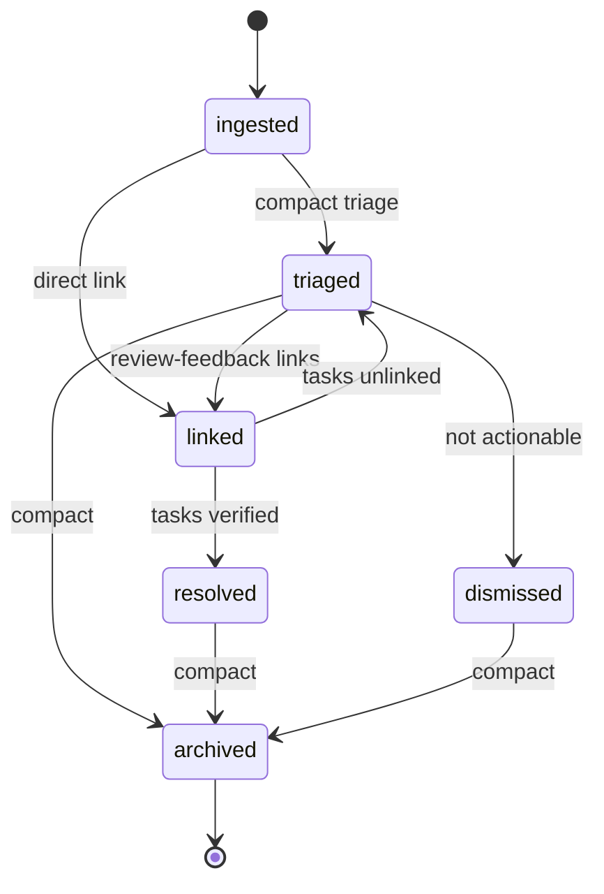

# Feedback Lifecycle

Every feedback artifact minted by Chanakya's ingest modes (`/chanakya ingest-slack`, `/chanakya ingest-thread`, `/chanakya ingest-dm`) or by the round-feedback path traverses this state machine. The artifact is `plans/feedback/<feedback-id>.yaml` (see `schemas/feedback.md`).

Phase 2.6 lands the state machine so ingesters have a stable write target. Phase 2.7 expands this doc with triage heuristics, synthesis rules, and root-cause promotion semantics — those pieces land when the knowledge layer ships.

## States

| State | Meaning | Who can enter |
|---|---|---|
| `ingested` | Just minted. No triage. | Chanakya ingest modes. |
| `triaged` | Labels + notes added by Chanakya compact sweep or manual review. | Chanakya compact / review-feedback modes. |
| `linked` | Linked to at least one task (`linked_tasks` non-empty). | Chanakya review-feedback mode or manual link. |
| `resolved` | Linked task/release reached terminal success — feedback addressed. | Chanakya review-feedback mode when the linked task enters `verified`, or when a linked release enters `released`. |
| `dismissed` | User rejected the feedback as not-actionable. Terminal. | Chanakya review-feedback mode with explicit user verdict. |
| `archived` | Post-compact cold storage. Terminal. | Chanakya compact mode. |

## Transitions

```
ingested   → triaged     : compact sweep adds labels/notes, or review-feedback reviews it.
ingested   → linked      : review-feedback links directly to a task without a triage pass.
triaged    → linked      : review-feedback attaches a task.
triaged    → dismissed   : user says not-actionable.
linked     → resolved    : every linked_task is `verified`, or linked release is `released`.
linked     → triaged     : all linked tasks get unlinked (rework case).
resolved   → archived    : compact sweep after N days.
dismissed  → archived    : compact sweep.
triaged    → archived    : compact sweep (edge case — triaged but never linked, and not dismissed).
```

Any non-terminal → `dismissed` is also legal when the user explicitly rejects at any point.

## Required fields per transition event

```json
{
  "ts": "2026-04-22T14:32:01Z",
  "agent": "chanakya",
  "event": "feedback_state_changed",
  "task": "F0ASZ6B22SZ",
  "data": {
    "from_state": "ingested",
    "to_state": "linked",
    "feedback_id": "0190f52a-a000-7001-8bbb-88ff9fa11ccc",
    "linked_task_id": "0190f52a-6e0c-7b3c-9a1d-0d4e9b7f6a11"
  }
}
```

`task` field carries the legacy feedback-id format (e.g. `F0ASZ6B22SZ`) where available, or `""` for feedback not yet assigned a short id. `data.feedback_id` is the authoritative UUIDv7.

## Resolution trigger

`linked → resolved` fires when **all** linked tasks reach `verified` (per `task-lifecycle.md`) **or** the linked release enters `released` (per `release-lifecycle.md`). Partial resolution keeps state at `linked` — feedback is one-to-many with tasks, and "addressed" means every linked task lands.

## Root-cause promotion (Phase 2.7 expansion point)

When Chanakya observes N+ distinct feedback records sharing a `root_cause_id` candidate (stack-trace fingerprint, error signature, or semantic cluster), it promotes one feedback record to `labels: [root_cause]` and back-references others to its `id` via their `root_cause_id` field. This is a **labeling operation, not a state transition** — the promoted record's state does not change as a result of promotion.

The N threshold + clustering rules land in Phase 2.7's knowledge-layer doc.

## Diagram



## Pairing with task + release lifecycles

- `linked → resolved` requires every task in `linked_tasks` to be `verified` (`task.state == verified`).
- When `linked_release` (in `source_metadata` for release-channel-sourced feedback) enters `released`, the feedback transitions `linked → resolved` regardless of task states. Direct release resolution bypasses per-task verification because the user sees the shipped fix.
- Resolution emits `feedback_state_changed` with `from_state: linked, to_state: resolved`.

## Related

- `schemas/feedback.md` — artifact shape; owns the `state` field.
- `state-machines/task-lifecycle.md` — resolution trigger source.
- `state-machines/release-lifecycle.md` — alternative resolution trigger.
- `contracts/events.md` — `feedback_ingested`, `feedback_archived`, `root_cause_promoted`, `feedback_state_changed` (new catalog entry landing with this file).
- `PHASE-2-7-PLAN.md` — knowledge-layer expansion of triage + synthesis rules.
