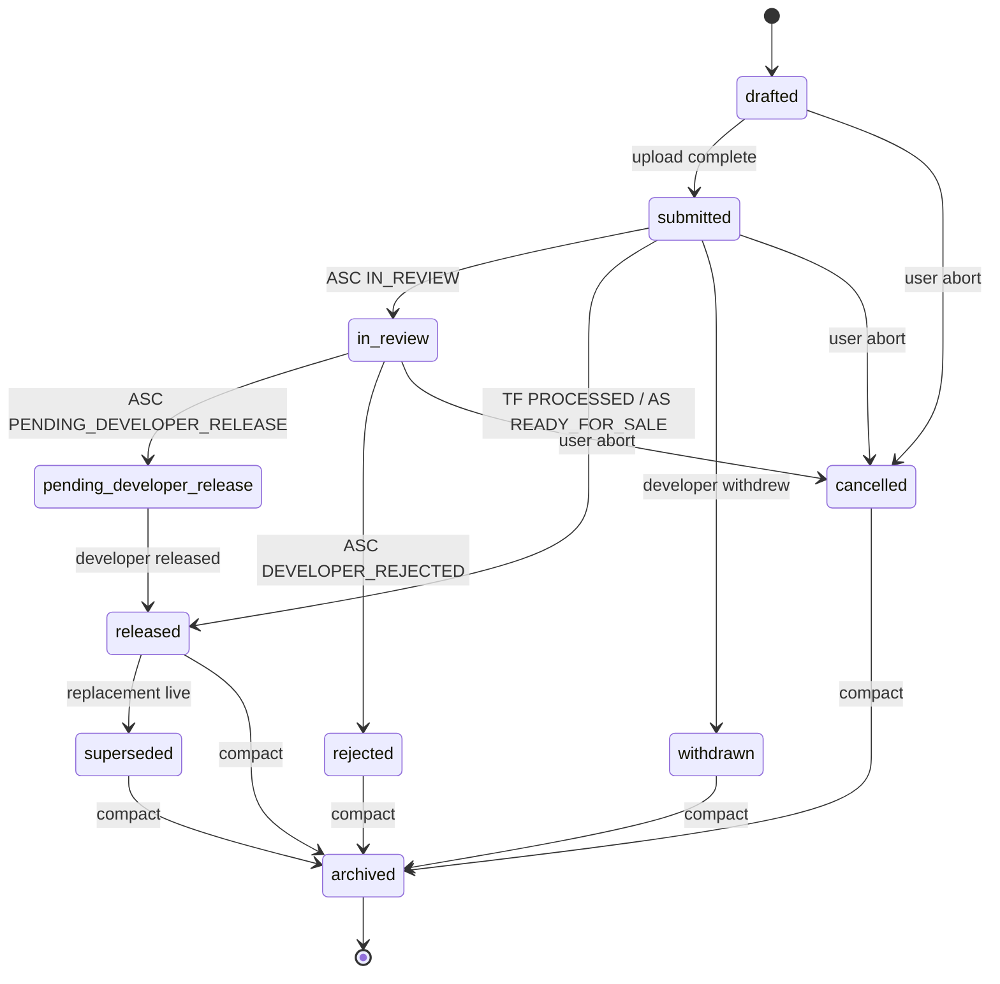

# Release Lifecycle

Every release routed through the studio — TestFlight or App Store — traverses this state machine. The artifact is `plans/releases/<release-id>.yaml` (see `schemas/release.md`); its `state` field carries the current value from this enum. Transitions emit `release_state_changed` events per `contracts/events.md`.

## States

| State | Meaning | Who can enter |
|---|---|---|
| `drafted` | Release artifact created but not yet submitted to ASC. | Achilles `push-tf` / `app-store` modes pre-upload. |
| `submitted` | Build uploaded to App Store Connect; ASC processing begins. | Achilles release modes post-upload. |
| `in-review` | Apple has started formal review (App Store channel only). | `scripts/appstore-watch.sh` on ASC state `IN_REVIEW`. |
| `pending-developer-release` | Apple approved; awaiting developer release (App Store channel only). This is not live and must not merge the source PR. | `scripts/appstore-watch.sh` on ASC state `PENDING_DEVELOPER_RELEASE`. |
| `released` | Live on the channel. TestFlight: processed + available to testers. App Store: shipped to production. App Store source PR merge and GitHub release publication happen only here. | `scripts/appstore-watch.sh` on ASC state `READY_FOR_SALE` (App Store) or `PROCESSED` for TestFlight. |
| `withdrawn` | Developer withdrew the submitted build before approval or release. The artifact is terminal but remains the audit anchor for a replacement. | Explicit withdrawal by release-manager/user after ASC submission. |
| `superseded` | Previously released artifact preserved for audit after a later release replaces the active pointer. | Release-manager correction path after the replacement is live. |
| `rejected` | Apple rejected the submission (App Store channel only). | `scripts/appstore-watch.sh` on ASC state `DEVELOPER_REJECTED` / `REJECTED`. |
| `cancelled` | User or agent cancelled the submission before review terminal. | Explicit cancellation by Chanakya or user. |
| `archived` | Post-compact cold storage. Terminal. | Chanakya compact mode. |

## Transitions

```
drafted               → submitted                 : build uploaded to ASC.
submitted             → in-review                 : ASC state IN_REVIEW (App Store only).
submitted             → released                  : ASC state PROCESSED / READY_FOR_SALE.
submitted             → withdrawn                 : developer withdrew before approval/release.
in-review             → pending-developer-release : ASC state PENDING_DEVELOPER_RELEASE.
in-review             → rejected                  : ASC state DEVELOPER_REJECTED / REJECTED.
pending-developer-release → released              : developer-release action landed.
rejected              → drafted                   : rework for resubmission; new release-id.
any non-terminal      → cancelled                 : explicit cancel.
released              → superseded                : replacement hotfix/correction is live.
released              → archived                  : compact sweep after N days.
rejected              → archived                  : compact sweep.
cancelled             → archived                  : compact sweep.
withdrawn             → archived                  : compact sweep.
superseded            → archived                  : compact sweep.
```

**Channel-specific notes:**

- **TestFlight channel** typically transitions `drafted → submitted → released`. ASC may emit build-processing states (`PROCESSING`, `INVALID_BINARY`) during `submitted`; these stay inside `submitted` until a terminal TF state is observed.
- **App Store channel** has the full review flow. `pending-developer-release` is the holdpoint where the release awaits the developer to push the "Release" button; it is not a merge signal. `READY_FOR_SALE` is the first unambiguous live signal and triggers the source PR merge with `gh pr merge --merge`.

## App Store PR Lifecycle

`/fullSendToAppStore` creates or reuses a PR from the submitted source branch to `main` immediately after the watcher marker is armed. PR creation is idempotent per source branch. If a different source branch already has a pending App Store PR, the submission continues and the user is notified that a separate PR is being raised.

The watcher keeps the PR open through `PENDING_DEVELOPER_RELEASE`. On `READY_FOR_SALE`, it publishes the draft GitHub release, updates the Slack thread link from the PR URL to the GitHub release URL when possible, includes `release_notes_summary` in the final Slack reply when the marker has one, then merges the PR with a merge commit. If `gh pr merge --merge` fails, the watcher posts `PR merge failed — conflicts detected. Manual resolution needed.` to the Slack thread and stops without attempting a rebase.

## Required fields per transition event

```json
{
  "ts": "2026-04-22T14:32:01Z",
  "agent": "achilles",
  "event": "release_state_changed",
  "task": "TF-3047",
  "data": {
    "from_state": "drafted",
    "to_state": "submitted",
    "channel": "testflight",
    "release_id": "0190f52a-9000-7f01-8aaa-77fe8fa99bbb",
    "asc_state": "PROCESSING"
  }
}
```

`task` field of the event carries the release tag (TF-nnnn or AS-nnnn) for continuity with the legacy event shape. `data.release_id` is the UUIDv7 of the release artifact — the authoritative identifier.

## Retry and backoff

`scripts/appstore-watch.sh` polls ASC on a self-throttling schedule (`next_check_at` in `asc_metadata`). Consecutive failures increment `asc_metadata.consecutive_failures`; ≥ 3 failures flip `asc_metadata.stuck: true` and emit `appstore_watch_stuck` (per existing `contracts/events.md`). `stuck` is orthogonal to `state` — a stuck release remains in its current state until the watcher recovers.

## Rejected → drafted (resubmission)

A rejected release does not transition back to `submitted` — the rejection is terminal for the artifact. Resubmission requires a new release artifact (new `id`, new build number) pointing at the same tasks. The old release stays in `rejected` forever; compact archives it eventually.

The rework relationship is tracked via an optional `rework_of: <prior-release-id>` field (additive — lands if needed; schemas/release.md does not require it yet).

## Withdrawn and superseded replacement flow

Use `withdrawn` when the developer pulls a submitted build before approval or release. The withdrawn artifact is terminal; do not reuse it for the replacement. Create a new release artifact for the hotfix build, set the replacement's `replaces` field to the withdrawn release-id, and set the withdrawn artifact's `superseded_by` field to the replacement release-id.

Use `superseded` when a release was already live but a later hotfix or correction becomes the active pointer. The original release keeps its tag, tasks, and release notes for audit, sets `superseded_by`, and transitions `released → superseded` only after the replacement is live. The replacement sets `replaces`.

GitHub Release convention for withdrawn builds: rename the GitHub Release title to `[WITHDRAWN] <tag>`, keep it as a draft, never promote it to Latest, and do not delete the git tag. Prepend a withdrawal banner to the release body with the replacement link when one exists.

Announcement continuity: update the existing announcement parent/thread when a build is withdrawn and replaced. Do not start a new top-level announcement for the replacement unless the original announcement was never sent.

## Diagram



## Pairing with task lifecycle

- `task.links.release` points at the release-id. Bidirectional: `release.tasks[]` contains the task-id.
- When a release enters `released`, the associated tasks' state is not automatically advanced — tasks follow their own lifecycle (user verification, etc.). A release's `released` is about the channel state, not task verification.

## Related

- `schemas/release.md` — release artifact shape; owner of the `state` field.
- `contracts/events.md` — `release_state_changed`, `appstore_*` catalog entries.
- `scripts/appstore-watch.sh` — ASC poller driving App Store transitions.
- `state-machines/task-lifecycle.md` — task side of the release linkage.
