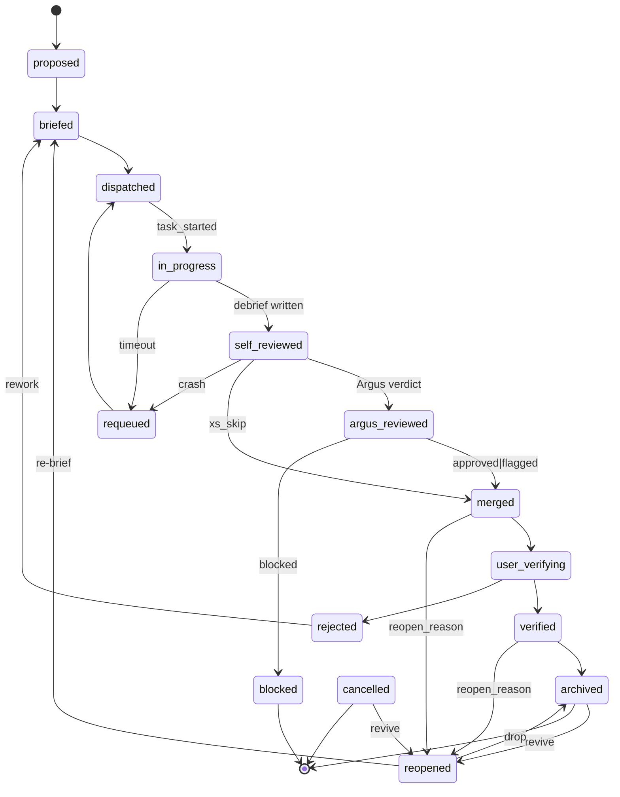

# Task Lifecycle

Every task routed through the studio traverses this state machine. The existing prose lifecycle in `chanakya-principles.md` (pending → briefed → in-progress → done → verified) is the user-facing summary; this file is the authoritative contract that state transitions, event payloads, and pre-commit validators reference.

## States

| State | Meaning | Who can enter |
|---|---|---|
| `proposed` | Task exists as an idea — captured but not briefed. | Chanakya, user intake. |
| `briefed` | Brief written and ready for dispatch. | Chanakya brief mode. |
| `dispatched` | Brief placed in a worker inbox or picked up by an interactive Achilles. | Chanakya dispatch modes. |
| `in-progress` | Achilles has started Step 2 (claim) in the worktree. | Achilles. |
| `self-reviewed` | Achilles debrief written, pre-Argus. | Achilles. |
| `argus-reviewed` | Argus returned a verdict (approved/flagged/blocked). | Argus. |
| `merged` | Merge lock released, branch merged to base. Not yet user-verified. | Achilles. |
| `user-verifying` | In the verification manifest, awaiting user sign-off. | Chanakya verify mode. |
| `verified` | User signed off via review-feedback. | Chanakya review-feedback mode. |
| `rejected` | User flagged the work as insufficient. Returns to `briefed` as a rework. | Chanakya review-feedback mode. |
| `archived` | Terminal; cold-storage after quarterly cleanup. | Chanakya compact mode. |
| `reopened` | Closed task brought back into the work queue with a recorded reason. Pre-brief — awaiting re-brief or re-archive. | Chanakya reopen mode. |

## Side states

| State | From which primary states | Notes |
|---|---|---|
| `blocked` | any non-terminal | External blocker (build env, missing upstream dep). Surfaced in status. |
| `cancelled` | any non-terminal | User or agent abort. Terminal. |
| `requeued` | `in-progress`, `self-reviewed` | Worker rescue / timeout / silent-stuck. Returns to `dispatched`. |

## Transitions (authoritative)

```
proposed       → briefed          : Chanakya brief mode writes the brief.
briefed        → dispatched       : brief@>=2 + worker idle marker present. REQUIRED.
dispatched     → in-progress      : Achilles emits `task_started`.
in-progress    → self-reviewed    : Achilles writes debrief (pre-Argus). REQUIRED.
self-reviewed  → argus-reviewed   : Argus emits `review_approved | review_flagged | review_blocked`.
argus-reviewed → merged           : verdict ∈ {approved, flagged}. REQUIRED.
argus-reviewed → blocked          : verdict == blocked and Achilles cannot fix.
merged         → user-verifying   : Chanakya adds to verify manifest.
user-verifying → verified         : user sign-off via review-feedback.
user-verifying → rejected         : user flags insufficient.
rejected       → briefed          : Chanakya re-briefs with `rework_of: <task-id>`.
verified       → archived         : compact sweep moves to archive.
verified       → reopened         : Chanakya reopen mode (`reopen_reason` REQUIRED).
merged         → reopened         : Chanakya reopen mode — merged but issue surfaced before user-verifying.
archived       → reopened         : Chanakya reopen mode — cold-storage task revived.
cancelled      → reopened         : Chanakya reopen mode — previously-aborted task revived.
reopened       → briefed          : Chanakya brief mode re-briefs; new brief inherits `reopen_chain`.
reopened       → archived         : decided not to address; terminal.
any            → cancelled        : user abort or explicit cancel.
any            → blocked          : external blocker.
blocked        → <prior state>    : when blocker resolves.
in-progress    → requeued         : worker timeout / silent-stuck.
self-reviewed  → requeued         : worker crash before Argus.
requeued       → dispatched       : automatic re-dispatch.
```

**Bypass clause — `xs-diff` exemption.** `argus-reviewed` can be skipped for XS-size diffs under 20 lines (per `ROADMAP.md` token-budget-posture rules). The transition `self-reviewed → merged` is legal iff the brief declares `size: XS` and the diff stat reports `<20` lines. Emit `review_scoped` with `cap: xs_skip` when taken.

**Reopen lifecycle.** Closed tasks (`verified | merged | archived | cancelled`) re-enter the work queue through `reopened`. The reopen transition REQUIRES `reopen_reason` (≤ 280 chars; conventional prefixes `qa-rejected:`, `design-rejected:`, `product-rejected:`, `regression:`, `incomplete:`). On entry, the task's prior `links.debrief` (if any) appends to `reopen_chain` so cross-cycle lineage survives. The next re-brief transitions `reopened → briefed`; the new brief carries the reopen reason and prior debrief reference verbatim, and Achilles's resulting debrief inherits `reopen_chain` so the chain accumulates monotonically. Schema fields `reopen_reason` and `reopen_chain` ship in `task@1.1.0` (see `_shared/schemas/task.md`); event payload defined under `task_reopened` in `_shared/contracts/events.md`.

## Required fields per transition event

Every state transition emits an event (producer side — consumer indexes by task):

```json
{
  "ts": "2026-04-22T14:32:01Z",
  "agent": "<actor>",
  "event": "task_state_changed",
  "task": "T001",
  "data": {
    "from_state": "briefed",
    "to_state": "dispatched",
    "actor": "chanakya",
    "reason": "worker-2 idle"
  }
}
```

Per `event-emission.md`, the event carries `producer` + `idempotency_key` (`<actor>:<mode>:<task>:<content-hash-of-transition>`).

## Diagram



## Related

- `brief-lifecycle.md` — the brief artifact's lifecycle (mostly orthogonal but aligns at `dispatched`).
- `review-lifecycle.md` — Argus verdict sub-states.
- `events.md` — `task_state_changed` event catalog entry.
- `chanakya-principles.md` — user-facing summary (5-state simplified view).
